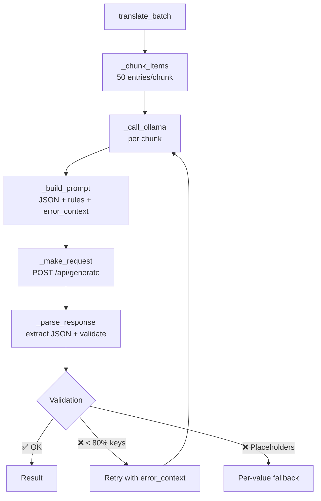

🇫🇷 [Français](README.md)  |  🇬🇧 [English](README.en.md)

# COP Translation Service

**Generic translation service for the COP project — Version 3.1**

Automatic translation of JSON and XLSX files via Google Translate, DeepL or **Ollama** (local LLM), with an intelligent cache, adaptive rate limiting, structural validation, and a full CLI interface.

## Table of contents

- [Features](#features)
- [Project structure](#project-structure)
- [Prerequisites](#prerequisites)
- [Installation](#installation)
- [Usage](#usage)
- [Operation modes](#operation-modes)
- [Orchestrated pipeline](#orchestrated-pipeline)
- [Dropdown pipeline (XLSX)](#dropdown-pipeline-xlsx)
- [Multi-provider and fallback](#multi-provider-and-fallback)
- [Ollama provider (IMP3)](#ollama-provider-imp3)
- [Intelligent cache](#intelligent-cache)
- [Adaptive rate limiter](#adaptive-rate-limiter)
- [Supported languages](#supported-languages)
- [Configuration](#configuration)
- [Tests](#tests)
- [Code quality](#code-quality)
- [Documentation](#documentation)
- [Contributing](#contributing)
- [License](#license)

## Features

| Feature | Description |
|---------------|-------------|
| **Multi-provider** | Google Translate (free), DeepL (API key), or **Ollama** (local/cloud LLM) |
| **Ollama + chunking** | Translation in batches of 50 entries, structural validation, intelligent retry, per-key Google Translate fallback on failure |
| **Intelligent cache** | Translations cached on disk (v2 composite keys `src:tgt:key_id:text`), avoiding re-translations and collisions between i18n keys sharing the same source text |
| **Dry-run** | `--dry-run` flag: simulates without any API call, without writing files/folders, without modifying the cache |
| **Adaptive rate limiter** | Exponential backoff with persistence, no double penalty |
| **CLI interface** | `translate-json`, `translate-dropdowns`, `analyze` with full options |
| **CLI provider** | `--provider`, `--deepl-api-key`, `--ollama-model`, `--fallback` flags on all subcommands |
| **Local execution** | Automatic Docker/local detection, adapted paths |
| **Automatic checkpoint** | Intermediate save every 100 entries (Google/DeepL) or per chunk (Ollama) |
| **Structural validation** | JSON, keys, types, placeholders (%s, {name}, `<b>`, ICU), 80% completeness threshold |
| **Pre-commit hooks** | ruff lint+format, trailing whitespace, YAML/JSON check, pytest-quick |
| **Optional CI** | GitHub Actions: lint, test, Docker build |

## Project structure

```
COP_translations/
├── .github/workflows/ci.yml        # GitHub Actions CI (optional)
├── .pre-commit-config.yaml          # Pre-commit hooks
├── doc/                             # Technical documentation
├── translator/
│   ├── core/
│   │   ├── cache.py                 # Intelligent translation cache
│   │   ├── config.py                # Centralized configuration (env + CLI)
│   │   ├── io_json.py               # JSON I/O (flat + structured)
│   │   ├── io_xlsx.py               # XLSX I/O
│   │   ├── ollama_provider.py        # Ollama provider with chunking and validation (IMP3)
│   │   ├── rate_limiter.py          # Adaptive rate limiter with persistence
│   │   ├── translator.py            # Translation logic (provider + cache + rate limit)
│   │   └── translator_factory.py    # Provider factory (Google, DeepL, Ollama, Fallback)
│   ├── modes/
│   │   ├── mode_translate_json.py   # JSON translation mode (per-chunk checkpoint)
│   │   ├── mode_translate_dropdowns.py # Dropdown generation mode
│   │   └── mode_analyze.py           # XLSX analysis mode
│   ├── tests/                       # 768 unit tests (94% coverage)
│   ├── service.py                   # CLI entry point
│   ├── benchmark_ollama.py          # Ollama models benchmark
│   ├── Dockerfile
│   ├── docker-compose.yml
│   ├── requirements.txt
│   ├── requirements-dev.txt
│   └── pytest.ini
├── source/                           # Source files
├── output/                           # Translated files
├── compare_sources.py                # Compare two JSON sources (added/removed/modified)
├── analyze_translation_gap.py         # Translation gap between an export and a new source
└── README.md
```

## Prerequisites

- **Docker** (version 20.10+) and **Docker Compose** (version 2.0+)
- **Python 3.11+** only for local development (pre-commit, tests)
- **DeepL API key** (optional, for DeepL or fallback)
- **Ollama** (optional, for the Ollama provider) — see [Ollama provider](#ollama-provider-imp3)

## Installation

### With Docker (recommended)

```bash
cd COP_translations

# Build the image
docker compose -f translator/docker-compose.yml build

# Run the tests
docker compose -f translator/docker-compose.yml run --rm --build test

# Run a translation (Google Translate by default)
docker compose -f translator/docker-compose.yml up --build
```

### Local development

> **Note:** A local Python install is **not required**. Everything runs in Docker, including the pre-commit hooks.

```bash
cd COP_translations

# Run the tests
docker compose -f translator/docker-compose.yml run --rm --build test

# Run the linter (ruff check + ruff format --check)
docker compose -f translator/docker-compose.yml run --rm lint
```

## Usage

### Docker — Google Translate (default)

```bash
# JSON translation EN → CS
docker compose -f translator/docker-compose.yml up --build

# JSON translation EN → FR
SOURCE_LANG=en TARGET_LANG=fr docker compose -f translator/docker-compose.yml up --build
```

### Docker — Ollama provider

```bash
# Make sure Ollama is running locally
ollama serve

# Translate with Ollama (default model: minimax-m3:cloud)
TRANSLATION_PROVIDER=ollama docker compose -f translator/docker-compose.yml up --build

# With a specific model
TRANSLATION_PROVIDER=ollama OLLAMA_MODEL=glm-5.1:cloud \
  docker compose -f translator/docker-compose.yml up --build

# EN → FR translation with Ollama
TRANSLATION_PROVIDER=ollama SOURCE_LANG=en TARGET_LANG=fr \
  docker compose -f translator/docker-compose.yml up --build
```

### CLI (full interface)

```bash
# General help
python translator/service.py --help

# JSON translation with Google (default)
python translator/service.py translate-json -s en -t fr -i source.json

# JSON translation with Ollama
python translator/service.py translate-json --provider ollama -s en -t fr -i source.json

# Ollama options
python translator/service.py translate-json --provider ollama \
  --ollama-model minimax-m3:cloud \
  --ollama-chunk-size 50 \
  --ollama-temperature 0 \
  --ollama-timeout 300 \
  -s en -t fr

# Use DeepL as the provider
python translator/service.py translate-json --provider deepl --deepl-api-key YOUR_KEY -s en -t fr

# Enable fallback between providers
python translator/service.py translate-json --provider ollama --fallback --deepl-api-key YOUR_KEY

# Simulation without API calls or writes (dry-run)
python translator/service.py translate-json --dry-run -s en --batch-langs fr,cz,sk,de,it,ar -i source.json
```

The CLI resolves parameters in this order: **CLI arguments > environment variables > default values**.

## Operation modes

| Mode | CLI | Description |
|------|-----|-------------|
| `translate-json` | `translate-json` | Translates a flat JSON file to a target language |
| `translate-dropdowns` | `translate-dropdowns` | Generates multi-language translations from an XLSX |
| `analyze` | `analyze` | Analyzes the structure of an XLSX file |

## Orchestrated pipeline

The pipeline (`translator/pipeline.py`) chains in **a single command** the full workflow of producing translated files from a new EN source: detection, analysis, pre-population, translation, validation and final report.

```bash
# Full interactive run (with confirmations at key steps)
python translator/pipeline.py

# Dry-run (analysis report without execution)
python translator/pipeline.py --dry-run

# Specific languages + forced provider
python translator/pipeline.py --languages fr,de --provider ollama
```

### The 11 steps

| Step | Description | Confirmation |
|---:|---|:---:|
| 1 | Auto-detection of the source (latest `*_Import`) + previous one | |
| 2 | Comparison of both sources (additions/deletions/modifications) | |
| 3 | Detection of known source typos + interactive correction | |
| 4 | Gap analysis between the last export and the new source | |
| 5 | Consolidated report + confirmation | ✅ |
| 6 | Output folder pre-population + modified keys handling (1/2/3) | ✅ |
| 7 | Translation (chosen provider: Google / Ollama / hybrid) | |
| 8 | Auto reordering according to source key order | |
| 9 | Structural validation (6 checks × N languages) | |
| 10 | Intra-language misalignment detection (token overlap heuristic) | |
| 11 | Final consolidated report → `doc/{date}_Pipeline_Report.md` | |

### CLI options

| Option | Description | Default |
|---|---|---|
| `--dry-run` | Analysis report without execution | `false` |
| `--languages fr,de` | Target languages (comma-separated) | all (except `en`) |
| `--provider` | `google` / `ollama` / `hybride` | `hybride` |
| `--source PATH` | Override new source detection | auto |
| `--prev-source PATH` | Override previous source detection | auto |
| `--report PATH` | Analysis report markdown path | stdout |
| `--yes` / `-y` | Non-interactive mode (validates all key steps) | `false` |

### Modified keys handling (step 6, interactive)

For each modified source key, the pipeline offers 3 actions:

- `[1] Re-translate`: removes the key from the output file → resume re-translates it
- `[2] Keep existing`: keeps the current translation
- `[3] Manual input`: enters a translation per language

### Automatic backup

Before each run, backup of existing files: `translation_en_{lang}.json.bak_pre_pipeline`.

### Technical details

See `doc/2026_07_08_Pipeline_Orchestre_Analyse.md` for the full architecture and `doc/2026_07_08_TDD_Methode_Etude.md` for the development methodology (TDD).

## Dropdown pipeline (XLSX)

The dropdown pipeline (`translator/pipeline.py --mode dropdown`) chains in **a single command** the full workflow of producing a translated dropdown XLSX file from a source XLSX: detection, analysis, pre-population, translation (reusing column B from existing sheets), validation and final report.

The project now provides **two orchestrated pipelines** accessible from a single command:

```bash
# JSON pipeline (default, unchanged)
python translator/pipeline.py --source en10.json --languages fr,de

# Dropdown pipeline (new)
python translator/pipeline.py --mode dropdown --source dropdown.xlsx --languages pt,es,hu
```

The mode is auto-detected from the source file extension (`.json` → json, `.xlsx` → dropdown). The `--mode` option forces the mode when needed.

### The 11 steps

| Step | Description | Confirmation |
|---:|---|:---:|
| 1 | XLSX source detection + data loading (per-language sheets) | |
| 2 | Sources comparison (skipped if no previous XLSX) | |
| 3 | Typo detection on Origins (`source_typos.json` with scope) | |
| 4 | Per-language gap analysis (missing Origins) | |
| 5 | Consolidated report + confirmation | ✅ |
| 6 | Output folder pre-population | ✅ |
| 7 | Translation (reusing column B from existing sheets) | |
| 8 | Reordering by Origin | |
| 9 | Validation (missing Origins, empty translations, untranslated) | |
| 10 | Intra-language misalignment detection (by context) | |
| 11 | Final report → `doc/{date}_Pipeline_Dropdown_Report.md` | |

### Dropdown-specific CLI options

| Option | Description | Default |
|---|---|---|
| `--mode dropdown` | Forces dropdown mode (auto-detected from `.xlsx` extension) | auto |
| `--format json\|xlsx\|auto` | Output format | auto |
| `--retranslate-all` | Ignore column B cache → re-translates all languages | `false` |
| `--retranslate fr,de` | Re-translates the listed languages, keeps cache for the others | — |
| `--no-cache` | Disables the service cache (`.translation_cache.json`) | `false` |

Generic options from the orchestrated pipeline (`--dry-run`, `--languages`, `--provider`, `--source`, `--prev-source`, `--report`, `--yes`) remain available.

### Two distinct caches

The dropdown pipeline manages two independent caches:

- **Column B cache** (source XLSX sheets): reuses translations already present in the per-language sheets of the source XLSX. Ignored with `--retranslate-all` or `--retranslate <lang>`.
- **Service cache** (`.translation_cache.json`): avoids re-translating via the API a text already translated. Disabled with `--no-cache`.

### DDD architecture

The dropdown pipeline is a bounded context distinct from the JSON pipeline:

- `pipeline_common.py`: shared kernel (helpers shared between both pipelines)
- `pipeline.py`: single dispatcher (`--mode json` or `dropdown`, auto-detection by default)
- `pipeline_dropdown.py`: dropdown orchestration (the 11 steps above)

## Multi-provider and fallback

The service supports three translation providers with automatic fallback:

| Provider | API key | Limit | Quality | Network |
|----------|---------|--------|---------|--------|
| **Google Translate** | None | 5 req/s | Standard | Yes (scraping) |
| **DeepL (Free)** | Required | 500k chars/month | Superior | Yes (API) |
| **DeepL (Pro)** | Required | Per plan | Superior | Yes (API) |
| **Ollama** | None | Unlimited (local) | Variable | **No** (local/cloud) |

### Automatic fallback

If fallback is enabled (`--fallback` or `TRANSLATION_FALLBACK=true`) and a DeepL key is provided, the service automatically switches to the secondary provider after **3 consecutive 429 errors** on the primary provider.

| Primary provider | Fallback provider |
|--------------------|---------------------|
| Google | DeepL (if key provided) |
| DeepL | Google |
| Ollama | Google |

### Provider configuration

| Variable | Default | Description |
|----------|--------|-------------|
| `TRANSLATION_PROVIDER` | `google` | Provider: `google`, `deepl` or `ollama` |
| `DEEPL_API_KEY` | *(empty)* | DeepL API key (required for `deepl`) |
| `DEEPL_USE_FREE_API` | `true` | Use the DeepL free API |
| `TRANSLATION_FALLBACK` | `false` | Enable automatic fallback |

## Ollama provider (IMP3)

The Ollama provider uses a local or cloud LLM to translate in batches, removing the network dependency and rate limiting.

### Architecture



### Structural validation (5 checks)

| # | Check | Action |
|---|----------|--------|
| 0 | Completeness < 80% | Full rejection → retry with error injection |
| 1 | Missing keys | Inject original value |
| 2 | Non-string types | Coercion (int→str) or fallback |
| 3 | Nested objects | Keep original value |
| 4 | Corrupted placeholders | Fallback to original value |

### Protected placeholders

| Category | Patterns | Examples |
|-----------|----------|----------|
| Python format | `%s`, `%d`, `%f` | `"Delete %s?"` |
| ICU / Mustache | `{name}`, `{{count}}`, `{0}` | `"{count} items"` |
| ICU plural | `{count, plural,` | `"{count, plural, one{item} other{items}}"` |
| HTML tags | `<b>`, `</b>`, `<br/>` | `"<b>Important</b>"` |
| Escapes | `\n`, `\t`, `\"` | `"Line1\nLine2"` |

### Ollama configuration variables

| Variable | Default | Description |
|----------|--------|-------------|
| `OLLAMA_URL` | `http://localhost:11434` | Ollama server URL (`http://host.docker.internal:11434` in Docker) |
| `OLLAMA_MODEL` | `minimax-m3:cloud` | Model to use |
| `OLLAMA_CHUNK_SIZE` | `50` | Chunk size (entries per request) |
| `OLLAMA_TEMPERATURE` | `0` | Model temperature (0 = deterministic) |
| `OLLAMA_TIMEOUT` | `300` | Per-chunk timeout in seconds |
| `OLLAMA_MAX_RETRIES` | `2` | Max retries per chunk |

### Benchmark (30 entries, FR + CZ)

| Model | Language | Time | JSON | Completeness | Placeholders | Fallbacks |
|--------|--------|-------|------|------------|-------------|-----------|
| `minimax-m3:cloud` | FR | 21.8s | ✅ | 100% | 15/15 (100%) | 0 |
| `minimax-m3:cloud` | CZ | 12.3s | ✅ | 100% | 15/15 (100%) | 0 |
| `minimax-m2.7:cloud` | FR | 17.8s | ✅ | 100% | 15/15 (100%) | 0 |
| `minimax-m2.7:cloud` | CZ | 23.1s | ✅ | 100% | 15/15 (100%) | 0 |
| `glm-5.1:cloud` | FR | 93.5s | ✅ | 100% | 15/15 (100%) | 0 |
| `glm-5.1:cloud` | CZ | 56.9s | ✅ | 100% | 15/15 (100%) | 0 |

> **Recommendation:** `minimax-m3:cloud` — default since 2026-06-17, faster and more stable. Local models (`qwen3`) require ≥8 GB RAM.

### Intelligent retry

When a chunk fails validation, the retry injects the error into the prompt:

```
CORRECTION NEEDED:
Previous attempt failed with this error: Response completion too low: 40%
Please fix the issue and return valid JSON following ALL the rules above.
```

After `max_retries` failures of a chunk, a **per-key Google Translate fallback** (`_fallback_per_key`) translates each entry individually via Google. Original values are kept only if Google also fails (or is unavailable).

### Docker + Ollama

The `docker-compose.yml` includes `extra_hosts: host.docker.internal:host-gateway` so the Docker container can reach Ollama on the host.

## Intelligent cache

The translation cache persists on disk (`output/.translation_cache.json`). Since v2, each translation is stored with the composite key `{source}:{target}:{key_id}:{text}` (with a fallback to the legacy `{source}:{target}:{text}` format for backward compatibility). The `key_id` (the original i18n key) avoids collisions between several keys sharing the same source text (e.g. "Action" used by 37 distinct keys).

| Feature | Detail |
|---------------|--------|
| **Activation** | `TRANSLATION_CACHE=true` (enabled by default) |
| **Key format** | v2 composite `src:tgt:key_id:text` (legacy fallback `src:tgt:text`) |
| **Cache path** | `output/.translation_cache.json` (Docker) or `cwd/output/.translation_cache.json` (local) |
| **Deferred flush** | Written at the end of a batch, not on every `put()` |
| **Statistics** | Hits, misses, hit rate, total entries |

The cache is consulted **before** any API call: already-translated terms are never re-translated.

## Adaptive rate limiter

The rate limiter automatically handles Google Translate API limits:

| Feature | Detail |
|---------------|--------|
| **429 detection** | Recognizes "Too Many Requests" errors |
| **Exponential backoff** | Increasing delay: 0.2s → 0.4s → 0.8s → 1.6s... |
| **No double penalty** | Rate limiter and retry do not apply backoff simultaneously |
| **Persistence** | State saved in `output/.rate_limiter_state.json` |

## Supported languages

| Code | Language | API target | Source column |
|------|--------|-----------|----------------|
| `en` | English | `en` | `origin` |
| `fr` | French | `fr` | `french` |
| `cz` | Czech | `cs` | `origin` |
| `sk` | Slovak | `sk` | `origin` |
| `de` | German | `de` | `origin` |
| `it` | Italian | `it` | `origin` |
| `ar` | Arabic | `ar` | `origin` |
| `pt` | Portuguese | `pt` | `origin` |
| `es` | Spanish | `es` | `origin` |
| `hu` | Hungarian | `hu` | `origin` |

## Configuration

### Environment variables

| Variable | Default | Description |
|----------|--------|-------------|
| `MODE` | `translate-json` | Operation mode |
| `SOURCE_LANG` | `en` | Source language |
| `TARGET_LANG` | `cs` | Target language (`translate-json` mode) |
| `SOURCE_FILE` | *(auto)* | Path to the source file |
| `OUTPUT_DIR` | *(auto)* | Output directory |
| `EXCEL_DIR` | *(auto)* | Excel files directory |
| `DOC_DIR` | *(auto)* | Documentation directory |
| `SOURCE_DIR` | *(auto)* | Source JSON files directory |
| `BATCH_LANGS` | `en,fr,cz,sk,de,it,ar,pt,es,hu` | Languages to generate (`translate-dropdowns` mode) |
| `OUTPUT_FORMAT` | `auto` | Output format: `json`, `xlsx` or `auto` |
| `TRANSLATION_CACHE` | `true` | Enable the translation cache |
| `TRANSLATION_CACHE_PATH` | *(auto)* | Cache file path |
| `TRANSLATION_PROVIDER` | `google` | Provider: `google`, `deepl` or `ollama` |
| `DEEPL_API_KEY` | *(empty)* | DeepL API key |
| `DEEPL_USE_FREE_API` | `true` | DeepL free API |
| `TRANSLATION_FALLBACK` | `false` | Automatic fallback |
| `OLLAMA_URL` | `http://localhost:11434` | Ollama server URL |
| `OLLAMA_MODEL` | `minimax-m3:cloud` | Ollama model |
| `OLLAMA_CHUNK_SIZE` | `50` | Chunk size |
| `OLLAMA_TEMPERATURE` | `0` | Model temperature (0 = deterministic) |
| `OLLAMA_TIMEOUT` | `300` | Per-chunk timeout (seconds) |
| `OLLAMA_MAX_RETRIES` | `2` | Max retries per chunk |

### Docker/local detection

Default paths adapt automatically:

| Variable | Docker | Local |
|----------|--------|-------|
| `OUTPUT_DIR` | `/app/output` | `{cwd}/output` |
| `SOURCE_DIR` | `/app/source` | `{cwd}/source` |
| `EXCEL_DIR` | `/app/excel` | `{cwd}/excel` |
| `DOC_DIR` | `/app/doc` | `{cwd}/Doc` |

Detection relies on the presence of `/.dockerenv` or `/run/.containerenv`.

### Resolution priority

```
CLI arguments > Environment variables > Default values
```

## Tests

```bash
# Run all tests (Docker)
docker compose -f translator/docker-compose.yml run --rm --build test

# Run the linter (ruff check + ruff format --check)
docker compose -f translator/docker-compose.yml run --rm lint
```

| Module | Stmts | Miss | Cover |
|--------|-------|------|-------|
| core/cache.py | 70 | 2 | 97% |
| core/config.py | 141 | 8 | 94% |
| core/io_json.py | 46 | 0 | 100% |
| core/io_xlsx.py | 95 | 7 | 93% |
| **core/ollama_provider.py** | **175** | **0** | **100%** |
| core/rate_limiter.py | 67 | 2 | 97% |
| core/translator.py | 93 | 0 | 100% |
| core/translator_factory.py | 101 | 11 | 89% |
| modes/mode_translate_json.py | 159 | 40 | 75% |
| modes/mode_translate_dropdowns.py | 195 | 3 | 98% |
| **Total** | **1218** | **75** | **94%** |

**768 tests** — TDD for all business features.

## Code quality

### Pre-commit hooks

The hooks run automatically before each commit, **entirely via Docker**:

| Step | Docker command | Description |
|-------|----------------|-------------|
| Lint | `docker compose -f translator/docker-compose.yml run --rm lint` | `ruff check . && ruff format --check .` |
| Tests | `docker compose -f translator/docker-compose.yml run --rm --build test` | `pytest` with coverage |

### GitHub Actions CI (optional)

The `.github/workflows/ci.yml` workflow triggers on push to `main`/`develop` and on PRs:

1. **lint** — ruff check + ruff format --check
2. **test** — pytest with coverage
3. **build** — Docker build + smoke test

## Documentation

| Document | Description |
|----------|-------------|
| [`doc/2026_05_13_Ollama_Provider_Study.md`](doc/2026_05_13_Ollama_Provider_Study.md) | Full Ollama provider study (720 lines, FR) |
| [`doc/2026_05_14_Ollama_IMP3_Amendement_Direction_Technique.md`](doc/2026_05_14_Ollama_IMP3_Amendement_Direction_Technique.md) | IMP3 technical amendments (866 lines, FR) |
| [`doc/2026_05_13_Brief_Handoff.md`](doc/2026_05_13_Brief_Handoff.md) | Project state and handoff (FR) |
| [`doc/2026_05_11_*Roadmap*.md`](doc/2026_05_11_Roadmap_v2_0_Plan.md) | v2.0 roadmap — improvement plan (FR) |
| [`doc/2026_05_06_*_Study.md`](doc/2026_05_06_COP_Translation_Service_Improvements_Study.md) | Improvements study (FR) |
| [`doc/2026_05_08_*_Tracking.md`](doc/2026_05_08_Implementation_Tracking.md) | Implementation tracking (FR) |
| [`doc/2026_05_05_*_Study.md`](doc/2026_05_05_COP_Translation_Service_Study.md) | Initial functional study (FR) |
| [`doc/2026_06_17_Cache_Improvement_Plan.md`](doc/2026_06_17_Cache_Improvement_Plan.md) | Cache v2: duplication analysis and improvement plan (FR) |
| [`doc/2026_06_23_Source_Comparison_Study.md`](doc/2026_06_23_Source_Comparison_Study.md) | en7 -> en8 source comparison + translation gap analysis (FR) |

> The technical documentation in `doc/` is written in French.

## Contributing

### Branches

| Branch | Role |
|---------|------|
| `main` | Stable code |
| `feat/IMP3-Txxx-description` | Per-task IMP3 branch |

Squash-merge to `main` when the task is done.

### Commit convention

```
feat(scope): description
fix(scope): description
test(scope): description
docs(scope): description
chore: description
```

### Quality

- **Pre-commit hooks** mandatory (ruff lint+format, checks, pytest-quick)
- **TDD** for all business features
- **94% coverage** on core modules

## Version history

| Version | Date | Description |
|---------|------|-------------|
| v3.2.0 | 2026-06-26 | Integration of 3 new languages (pt, es, hu); 9 target languages; Ollama minimax-m3:cloud for full runs; 768+ tests |
| v3.1.0 | 2026-06-23 | Cache v2 (composite `key_id` keys), Ollama per-key Google fallback, working `--dry-run` flag, 768 tests |
| v3.0.0 | 2026-05-27 | Ollama provider (IMP3): chunking, structural validation, intelligent retry, placeholders, per-chunk checkpoint, 723 tests, 94% coverage |
| v2.0.0 | 2026-05-11 | Intelligent cache, adaptive rate limiter, CLI, multi-provider, CLI provider flags, pre-commit hooks, local paths, 620 tests, 96% coverage |
| v1.0.0 | 2026-05-05 | Initial version with intelligent rate limiter |

## License

This project is private and confidential. All rights reserved.