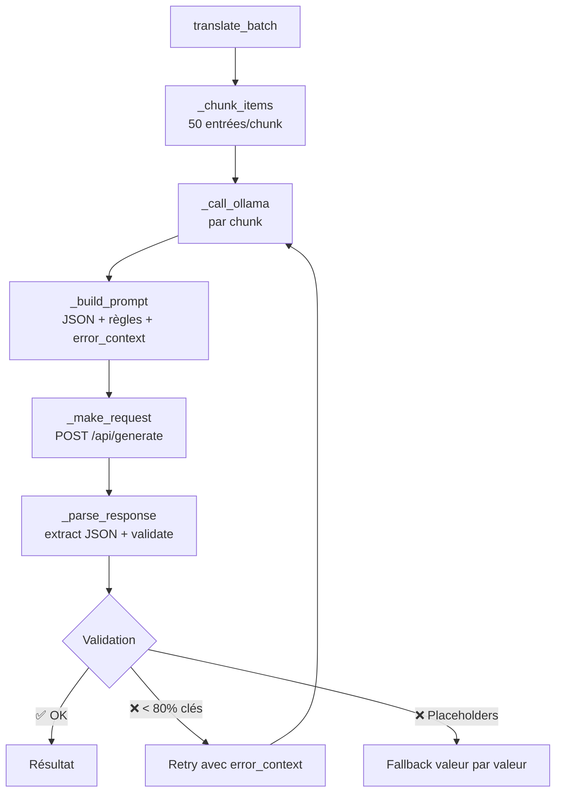

🇫🇷 [Français](README.md)  |  🇬🇧 [English](README.en.md)

# COP Translation Service

**Service de traduction générique pour le projet COP — Version 3.1**

Traduction automatique de fichiers JSON et XLSX via Google Translate, DeepL ou **Ollama** (LLM local), avec cache intelligent, rate limiting adaptatif, validation structurelle, et interface CLI complète.

## Table des matières

- [Fonctionnalités](#fonctionnalités)
- [Structure du projet](#structure-du-projet)
- [Prérequis](#prérequis)
- [Installation](#installation)
- [Utilisation](#utilisation)
- [Modes d'opération](#modes-dopération)
- [Pipeline orchestré](#pipeline-orchestré)
- [Pipeline dropdown (XLSX)](#pipeline-dropdown-xlsx)
- [Multi-Provider et Fallback](#multi-provider-et-fallback)
- [Provider Ollama (IMP3)](#provider-ollama-imp3)
- [Cache intelligent](#cache-intelligent)
- [Rate limiter adaptatif](#rate-limiter-adaptatif)
- [Langues supportées](#langues-supportées)
- [Configuration](#configuration)
- [Tests](#tests)
- [Qualité de code](#qualité-de-code)
- [Documentation](#documentation)
- [Contribution](#contribution)
- [Licence](#licence)

## Fonctionnalités

| Fonctionnalité | Description |
|---------------|-------------|
| **Multi-Provider** | Google Translate (gratuit), DeepL (API key), ou **Ollama** (LLM local/cloud) |
| **Ollama + chunking** | Traduction par batchs de 50 entrées, validation structurelle, retry intelligent, fallback Google Translate par clé sur échec |
| **Cache intelligent** | Traductions mises en cache sur disque (clés composites v2 `src:tgt:key_id:text`), évitant re-traductions et collisions entre clés i18n partageant le même texte source |
| **Dry-run** | Flag `--dry-run` : simule sans appel API, sans écriture de fichier/dossier, sans modifier le cache |
| **Rate limiter adaptatif** | Backoff exponentiel avec persistance, sans double pénalité |
| **Interface CLI** | `translate-json`, `translate-dropdowns`, `analyze` avec options complètes |
| **CLI Provider** | Flags `--provider`, `--deepl-api-key`, `--ollama-model`, `--fallback` sur tous les subcommands |
| **Exécution locale** | Détection Docker/local automatique, chemins adaptés |
| **Checkpoint automatique** | Sauvegarde intermédiaire tous les 100 entrées (Google/DeepL) ou par chunk (Ollama) |
| **Validation structurelle** | Vérification JSON, clés, types, placeholders (%s, {name}, `<b>`, ICU), seuil de complétude 80% |
| **Pre-commit hooks** | ruff lint+format, trailing whitespace, YAML/JSON check, pytest-quick |
| **CI optionnelle** | GitHub Actions : lint, test, build Docker |

## Structure du projet

```
COP_translations/
├── .github/workflows/ci.yml        # CI GitHub Actions (optionnel)
├── .pre-commit-config.yaml          # Pre-commit hooks
├── doc/                             # Documentation technique
├── translator/
│   ├── core/
│   │   ├── cache.py                 # Cache intelligent de traductions
│   │   ├── config.py                # Configuration centralisée (env + CLI)
│   │   ├── io_json.py               # Lecture/écriture JSON (plat + structuré)
│   │   ├── io_xlsx.py               # Lecture/écriture XLSX
│   │   ├── ollama_provider.py        # Provider Ollama avec chunking et validation (IMP3)
│   │   ├── rate_limiter.py          # Rate limiter adaptatif avec persistance
│   │   ├── translator.py            # Logique de traduction (provider + cache + rate limit)
│   │   └── translator_factory.py    # Factory de providers (Google, DeepL, Ollama, Fallback)
│   ├── modes/
│   │   ├── mode_translate_json.py   # Mode traduction JSON (avec checkpoint par chunk)
│   │   ├── mode_translate_dropdowns.py # Mode génération dropdowns
│   │   └── mode_analyze.py           # Mode analyse XLSX
│   ├── tests/                       # 1027 tests unitaires (94% couverture)
│   ├── service.py                   # Point d'entrée CLI
│   ├── pipeline.py                  # Pipeline orchestré JSON (dispatcher --mode)
│   ├── pipeline_dropdown.py          # Pipeline orchestré dropdown (XLSX)
│   ├── pipeline_common.py           # Shared kernel des deux pipelines
│   ├── source_typos.json            # Dictionnaire des coquilles source connues
│   ├── validate_translations.py     # Validation structurelle des traductions
│   ├── benchmark_ollama.py          # Benchmark comparatif des modèles Ollama
│   ├── Dockerfile
│   ├── docker-compose.yml
│   ├── requirements.txt
│   ├── requirements-dev.txt
│   └── pytest.ini
├── source/                           # Fichiers source
├── output/                           # Fichiers traduits
├── compare_sources.py                # Comparaison de deux sources JSON (ajouts/suppressions/modifs)
├── analyze_translation_gap.py         # Écart de traduction entre un export et une nouvelle source
└── README.md
```

## Prérequis

- **Docker** (version 20.10+) et **Docker Compose** (version 2.0+)
- **Python 3.11+** uniquement pour le développement local (pre-commit, tests)
- **Clé API DeepL** (optionnel, pour DeepL ou le fallback)
- **Ollama** (optionnel, pour le provider Ollama) — voir [Provider Ollama](#provider-ollama-imp3)

## Installation

### Avec Docker (recommandé)

```bash
cd COP_translations

# Builder l'image
docker compose -f translator/docker-compose.yml build

# Lancer les tests
docker compose -f translator/docker-compose.yml run --rm --build test

# Lancer une traduction (Google Translate par défaut)
docker compose -f translator/docker-compose.yml up --build
```

### Développement local

> **Note :** L'installation locale de Python n'est **pas requise**. Tout tourne en Docker, y compris les pre-commit hooks.

```bash
cd COP_translations

# Lancer les tests
docker compose -f translator/docker-compose.yml run --rm --build test

# Lancer le lint (ruff check + ruff format --check)
docker compose -f translator/docker-compose.yml run --rm lint
```

## Utilisation

### Docker — Google Translate (par défaut)

```bash
# Traduction JSON EN → CS
docker compose -f translator/docker-compose.yml up --build

# Traduction JSON EN → FR
SOURCE_LANG=en TARGET_LANG=fr docker compose -f translator/docker-compose.yml up --build
```

### Docker — Provider Ollama

```bash
# S'assurer qu'Ollama est lancé localement
ollama serve

# Traduction avec Ollama (modèle par défaut : minimax-m3:cloud)
TRANSLATION_PROVIDER=ollama docker compose -f translator/docker-compose.yml up --build

# Avec un modèle spécifique
TRANSLATION_PROVIDER=ollama OLLAMA_MODEL=glm-5.1:cloud \
  docker compose -f translator/docker-compose.yml up --build

# Traduction EN → FR avec Ollama
TRANSLATION_PROVIDER=ollama SOURCE_LANG=en TARGET_LANG=fr \
  docker compose -f translator/docker-compose.yml up --build
```

### CLI (interface complète)

```bash
# Aide générale
python translator/service.py --help

# Traduction JSON avec Google (par défaut)
python translator/service.py translate-json -s en -t fr -i source.json

# Traduction JSON avec Ollama
python translator/service.py translate-json --provider ollama -s en -t fr -i source.json

# Options Ollama
python translator/service.py translate-json --provider ollama \
  --ollama-model minimax-m3:cloud \
  --ollama-chunk-size 50 \
  --ollama-temperature 0 \
  --ollama-timeout 300 \
  -s en -t fr

# Utiliser DeepL comme provider
python translator/service.py translate-json --provider deepl --deepl-api-key YOUR_KEY -s en -t fr

# Activer le fallback entre providers
python translator/service.py translate-json --provider ollama --fallback --deepl-api-key YOUR_KEY

# Simulation sans appel API ni écriture (dry-run)
python translator/service.py translate-json --dry-run -s en --batch-langs fr,cz,sk,de,it,ar -i source.json
```

La CLI résout les paramètres dans cet ordre : **arguments CLI > variables d'environnement > valeurs par défaut**.

## Modes d'opération

| Mode | CLI | Description |
|------|-----|-------------|
| `translate-json` | `translate-json` | Traduit un fichier JSON plat vers une langue cible |
| `translate-dropdowns` | `translate-dropdowns` | Génère les traductions multi-langues depuis un XLSX |
| `analyze` | `analyze` | Analyse la structure d'un fichier XLSX |

## Pipeline orchestré

Le pipeline (`translator/pipeline.py`) enchaîne en **une seule commande** le parcours complet de production des fichiers traduits à partir d'une nouvelle source EN : détection, analyse, pré-peuplement, traduction, validation et rapport final.

```bash
# Run complet interactif (avec confirmations aux étapes clés)
python translator/pipeline.py

# Dry-run (rapport d'analyse sans exécution)
python translator/pipeline.py --dry-run

# Langues spécifiques + provider forcé
python translator/pipeline.py --languages fr,de --provider ollama
```

### Les 11 étapes

| Étape | Description | Confirmation |
|---:|---|:---:|
| 1 | Détection auto de la source (dernier `*_Import`) + précédente | |
| 2 | Comparaison des deux sources (ajouts/suppressions/modifications) | |
| 3 | Détection des coquilles source connues + correction interactive | |
| 4 | Analyse de l'écart entre le dernier export et la nouvelle source | |
| 5 | Rapport consolidé + confirmation | ✅ |
| 6 | Pré-peuplement du dossier output + gestion clés modifiées (1/2/3) | ✅ |
| 7 | Traduction (provider choisi : Google / Ollama / hybride) | |
| 8 | Réordonnancement auto selon l'ordre source | |
| 9 | Validation structurelle (6 contrôles × N langues) | |
| 10 | Détection mésalignements intra-langue (heuristique token overlap) | |
| 11 | Rapport consolidé final → `doc/{date}_Pipeline_Report.md` | |

### Options CLI

| Option | Description | Défaut |
|---|---|---|
| `--dry-run` | Rapport d'analyse sans exécution | `false` |
| `--languages fr,de` | Langues cibles (séparées par virgules) | toutes (hors `en`) |
| `--provider` | `google` / `ollama` / `hybride` | `hybride` |
| `--source PATH` | Override la détection de la nouvelle source | auto |
| `--prev-source PATH` | Override la détection de la source précédente | auto |
| `--report PATH` | Chemin du rapport markdown d'analyse | stdout |
| `--yes` / `-y` | Mode non-interactif (valide toutes les étapes clés) | `false` |
| `--no-cache` | Désactive le cache du service (`.translation_cache.json`) | `false` |
| `--mode json\|dropdown` | Force le mode du pipeline (auto-détecté par extension sinon) | auto |

### Gestion des clés modifiées (étape 6, interactive)

Pour chaque clé source modifiée, le pipeline propose 3 actions :

- `[1] Retraduire` : supprime la clé du fichier de sortie → la reprise la retraduit
- `[2] Garder l'existant` : conserve la traduction actuelle
- `[3] Saisir manuellement` : saisie d'une traduction par langue

### Sauvegarde automatique

Avant chaque run, backup des fichiers existants : `translation_en_{lang}.json.bak_pre_pipeline`.

### Détail technique

Voir `doc/2026_07_08_Pipeline_Orchestre_Analyse.md` pour l'architecture complète et `doc/2026_07_08_TDD_Methode_Etude.md` pour la méthodologie de développement (TDD).

## Pipeline dropdown (XLSX)

Le pipeline dropdown (`translator/pipeline.py --mode dropdown`) enchaîne en **une seule commande** le parcours complet de production d'un fichier XLSX dropdown traduit à partir d'un XLSX source : détection, analyse, pré-peuplement, traduction (avec réutilisation de la colonne B des feuilles existantes), validation et rapport final.

Le projet dispose désormais de **deux pipelines orchestrés** accessibles depuis une seule commande :

```bash
# Pipeline JSON (par défaut, inchangé)
python translator/pipeline.py --source en10.json --languages fr,de

# Pipeline dropdown (nouveau)
python translator/pipeline.py --mode dropdown --source dropdown.xlsx --languages pt,es,hu
```

Le mode est auto-détecté par l'extension du fichier source (`.json` → json, `.xlsx` → dropdown). L'option `--mode` force le mode si nécessaire.

### Les 11 étapes

| Étape | Description | Confirmation |
|---:|---|:---:|
| 1 | Détection source XLSX + chargement des données (feuilles par langue) | |
| 2 | Comparaison des sources (skip si pas de XLSX précédent) | |
| 3 | Détection des coquilles sur Origins (`source_typos.json` avec scope) | |
| 4 | Analyse de l'écart par langue (Origins manquants) | |
| 5 | Rapport consolidé + confirmation | ✅ |
| 6 | Pré-peuplement du dossier de sortie | ✅ |
| 7 | Traduction (avec réutilisation colonne B des feuilles existantes) | |
| 8 | Réordonnancement par Origin | |
| 9 | Validation (Origins manquants, traductions vides, non traduits) | |
| 10 | Détection mésalignements intra-langue (par contexte) | |
| 11 | Rapport final → `doc/{date}_Pipeline_Dropdown_Report.md` | |

### Options CLI spécifiques au dropdown

| Option | Description | Défaut |
|---|---|---|
| `--mode dropdown` | Force le mode dropdown (auto-détection par extension `.xlsx`) | auto |
| `--format json\|xlsx\|auto` | Format de sortie | auto |
| `--retranslate-all` | Ignore le cache colonne B → re-traduit toutes les langues | `false` |
| `--retranslate fr,de` | Retraduit les langues listées, garde le cache pour les autres | — |
| `--no-cache` | Désactive le cache du service (`.translation_cache.json`) | `false` |

Les options génériques du pipeline orchestré (`--dry-run`, `--languages`, `--provider`, `--source`, `--prev-source`, `--report`, `--yes`) restent disponibles.

### Deux caches distincts

Le pipeline dropdown gère deux caches indépendants :

- **Cache colonne B** (feuilles du XLSX source) : réutilise les traductions déjà présentes dans les feuilles par langue du XLSX source. Ignoré avec `--retranslate-all` ou `--retranslate <lang>`.
- **Cache du service** (`.translation_cache.json`) : évite de re-traduire via l'API un texte déjà traduit. Désactivé avec `--no-cache`.

### Architecture DDD

Le pipeline dropdown est un bounded context distinct du pipeline JSON :

- `pipeline_common.py` : shared kernel (helpers partagés entre les deux pipelines)
- `pipeline.py` : dispatcher unique (`--mode json` ou `dropdown`, auto-détection par défaut)
- `pipeline_dropdown.py` : orchestration dropdown (les 11 étapes ci-dessus)

### Docker

Le service `pipeline` du `docker-compose.yml` expose les deux pipelines orchestrés dans un conteneur isolé (entrypoint `python pipeline.py`). Les volumes `./source`, `./output` et `../doc` sont montés.

```bash
# Pipeline JSON via Docker

docker compose -f translator/docker-compose.yml run --rm pipeline --dry-run --languages fr,de

# Pipeline dropdown via Docker
docker compose -f translator/docker-compose.yml run --rm pipeline --mode dropdown --source /app/source/dropdown.xlsx --languages pt,es,hu --yes
```

Les variables d'environnement du service `pipeline` (`TRANSLATION_PROVIDER`, `OLLAMA_URL`, `OLLAMA_MODEL`, `DEEPL_API_KEY`, …) sont héritées du `docker-compose.yml` et surchargeables via l'environnement shell.

## Multi-Provider et Fallback

Le service supporte trois providers de traduction avec fallback automatique :

| Provider | Clé API | Limite | Qualité | Réseau |
|----------|---------|--------|---------|--------|
| **Google Translate** | Aucune | 5 req/s | Standard | Oui (scraping) |
| **DeepL (Free)** | Requise | 500k chars/mois | Supérieure | Oui (API) |
| **DeepL (Pro)** | Requise | Selon forfait | Supérieure | Oui (API) |
| **Ollama** | Aucune | Illimitée (local) | Variable | **Non** (local/cloud) |

### Fallback automatique

Si le fallback est activé (`--fallback` ou `TRANSLATION_FALLBACK=true`) et qu'une clé DeepL est fournie, le service bascule automatiquement vers le provider secondaire après **3 erreurs 429 consécutives** sur le provider principal.

| Provider principal | Provider de fallback |
|--------------------|---------------------|
| Google | DeepL (si clé fournie) |
| DeepL | Google |
| Ollama | Google |

### Configuration des providers

| Variable | Défaut | Description |
|----------|--------|-------------|
| `TRANSLATION_PROVIDER` | `google` | Provider : `google`, `deepl` ou `ollama` |
| `DEEPL_API_KEY` | *(vide)* | Clé API DeepL (requise pour `deepl`) |
| `DEEPL_USE_FREE_API` | `true` | Utiliser l'API gratuite DeepL |
| `TRANSLATION_FALLBACK` | `false` | Activer le fallback automatique |

## Provider Ollama (IMP3)

Le provider Ollama utilise un LLM local ou cloud pour traduire par batchs, éliminant la dépendance réseau et le rate limiting.

### Architecture



### Validation structurelle (5 contrôles)

| # | Contrôle | Action |
|---|----------|--------|
| 0 | Complétude < 80% | Rejet complet → retry avec injection d'erreur |
| 1 | Clés manquantes | Injecter valeur originale |
| 2 | Types non-string | Coercion (int→str) ou fallback |
| 3 | Objets imbriqués | Garder valeur originale |
| 4 | Placeholders corrompus | Fallback vers valeur originale |

### Placeholders protégés

| Catégorie | Patterns | Exemples |
|-----------|----------|----------|
| Format Python | `%s`, `%d`, `%f` | `"Delete %s?"` |
| ICU / Mustache | `{name}`, `{{count}}`, `{0}` | `"{count} items"` |
| ICU Plural | `{count, plural,` | `"{count, plural, one{item} other{items}}"` |
| Balises HTML | `<b>`, `</b>`, `<br/>` | `"<b>Important</b>"` |
| Échappements | `\n`, `\t`, `\"` | `"Line1\nLine2"` |

### Variables de configuration Ollama

| Variable | Défaut | Description |
|----------|--------|-------------|
| `OLLAMA_URL` | `http://localhost:11434` | URL du serveur Ollama (`http://host.docker.internal:11434` en Docker) |
| `OLLAMA_MODEL` | `minimax-m3:cloud` | Modèle à utiliser |
| `OLLAMA_CHUNK_SIZE` | `50` | Taille des chunks (entrées par requête) |
| `OLLAMA_TEMPERATURE` | `0` | Température du modèle (0 = déterministe) |
| `OLLAMA_TIMEOUT` | `300` | Timeout par chunk en secondes |
| `OLLAMA_MAX_RETRIES` | `2` | Max retries par chunk |

### Benchmark (30 entrées, FR + CZ)

| Modèle | Langue | Temps | JSON | Complétude | Placeholders | Fallbacks |
|--------|--------|-------|------|------------|-------------|-----------|
| `minimax-m3:cloud` | FR | 21.8s | ✅ | 100% | 15/15 (100%) | 0 |
| `minimax-m3:cloud` | CZ | 12.3s | ✅ | 100% | 15/15 (100%) | 0 |
| `minimax-m2.7:cloud` | FR | 17.8s | ✅ | 100% | 15/15 (100%) | 0 |
| `minimax-m2.7:cloud` | CZ | 23.1s | ✅ | 100% | 15/15 (100%) | 0 |
| `glm-5.1:cloud` | FR | 93.5s | ✅ | 100% | 15/15 (100%) | 0 |
| `glm-5.1:cloud` | CZ | 56.9s | ✅ | 100% | 15/15 (100%) | 0 |

> **Recommandation :** `minimax-m3:cloud` — défaut depuis 17/06/2026, plus rapide et plus stable. Modèles locaux (`qwen3`) nécessitent ≥8 GB RAM.

### Retry intelligent

Quand un chunk échoue la validation, le retry injecte l'erreur dans le prompt :

```
CORRECTION NEEDED:
Previous attempt failed with this error: Response completion too low: 40%
Please fix the issue and return valid JSON following ALL the rules above.
```

Après `max_retries` échecs d'un chunk, un **fallback Google Translate par clé** (`_fallback_per_key`) traduit chaque entrée individuellement via Google. Les valeurs originales ne sont conservées que si Google échoue aussi (ou n'est pas disponible).

### Docker + Ollama

Le `docker-compose.yml` inclut `extra_hosts: host.docker.internal:host-gateway` pour que le conteneur Docker accède à Ollama sur le host.

## Cache intelligent

Le cache de traductions persiste sur disque (`output/.translation_cache.json`). Depuis la v2, chaque traduction est stockée avec la clé composite `{source}:{target}:{key_id}:{text}` (avec fallback sur le format legacy `{source}:{target}:{text}` pour la rétro-compatibilité). Le `key_id` (clé i18n d'origine) évite les collisions entre plusieurs clés partageant le même texte source (ex. « Action » utilisée par 37 clés distinctes).

| Fonctionnalité | Détail |
|---------------|--------|
| **Activation** | `TRANSLATION_CACHE=true` (activé par défaut) |
| **Format des clés** | v2 composite `src:tgt:key_id:text` (fallback legacy `src:tgt:text`) |
| **Chemin du cache** | `output/.translation_cache.json` (Docker) ou `cwd/output/.translation_cache.json` (local) |
| **Flush différé** | Écrit en fin de batch, pas à chaque `put()` |
| **Statistiques** | Hits, misses, hit rate, total entries |

Le cache est consulté **avant** tout appel API : les termes déjà traduits ne sont jamais re-traduits.

## Rate limiter adaptatif

Le rate limiter gère automatiquement les limites de l'API Google Translate :

| Fonctionnalité | Détail |
|---------------|--------|
| **Détection 429** | Reconnu les erreurs "Too Many Requests" |
| **Backoff exponentiel** | Délai croissant : 0.2s → 0.4s → 0.8s → 1.6s... |
| **Pas de double pénalité** | Rate limiter et retry n'appliquent pas de backoff simultané |
| **Persistance** | État sauvegardé dans `output/.rate_limiter_state.json` |

## Langues supportées

| Code | Langue | Cible API | Colonne source |
|------|--------|-----------|----------------|
| `en` | Anglais | `en` | `origin` |
| `fr` | Français | `fr` | `french` |
| `cz` | Tchèque | `cs` | `origin` |
| `sk` | Slovaque | `sk` | `origin` |
| `de` | Allemand | `de` | `origin` |
| `it` | Italien | `it` | `origin` |
| `ar` | Arabe | `ar` | `origin` |
| `pt` | Portugais | `pt` | `origin` |
| `es` | Espagnol | `es` | `origin` |
| `hu` | Hongrois | `hu` | `origin` |

## Configuration

### Variables d'environnement

| Variable | Défaut | Description |
|----------|--------|-------------|
| `MODE` | `translate-json` | Mode d'opération |
| `SOURCE_LANG` | `en` | Langue source |
| `TARGET_LANG` | `cs` | Langue cible (mode `translate-json`) |
| `SOURCE_FILE` | *(auto)* | Chemin vers le fichier source |
| `OUTPUT_DIR` | *(auto)* | Répertoire de sortie |
| `EXCEL_DIR` | *(auto)* | Répertoire des fichiers Excel |
| `DOC_DIR` | *(auto)* | Répertoire de documentation |
| `SOURCE_DIR` | *(auto)* | Répertoire des fichiers source JSON |
| `BATCH_LANGS` | `en,fr,cz,sk,de,it,ar,pt,es,hu` | Langues à générer (mode `translate-dropdowns`) |
| `OUTPUT_FORMAT` | `auto` | Format de sortie : `json`, `xlsx` ou `auto` |
| `TRANSLATION_CACHE` | `true` | Activer le cache de traductions |
| `TRANSLATION_CACHE_PATH` | *(auto)* | Chemin du fichier cache |
| `TRANSLATION_PROVIDER` | `google` | Provider : `google`, `deepl` ou `ollama` |
| `DEEPL_API_KEY` | *(vide)* | Clé API DeepL |
| `DEEPL_USE_FREE_API` | `true` | API gratuite DeepL |
| `TRANSLATION_FALLBACK` | `false` | Fallback automatique |
| `OLLAMA_URL` | `http://localhost:11434` | URL du serveur Ollama |
| `OLLAMA_MODEL` | `minimax-m3:cloud` | Modèle Ollama |
| `OLLAMA_CHUNK_SIZE` | `50` | Taille des chunks |
| `OLLAMA_TEMPERATURE` | `0` | Température du modèle (0 = déterministe) |
| `OLLAMA_TIMEOUT` | `300` | Timeout par chunk (secondes) |
| `OLLAMA_MAX_RETRIES` | `2` | Max retries par chunk |

### Détection Docker/local

Les chemins par défaut s'adaptent automatiquement :

| Variable | Docker | Local |
|----------|--------|-------|
| `OUTPUT_DIR` | `/app/output` | `{cwd}/output` |
| `SOURCE_DIR` | `/app/source` | `{cwd}/source` |
| `EXCEL_DIR` | `/app/excel` | `{cwd}/excel` |
| `DOC_DIR` | `/app/doc` | `{cwd}/Doc` |

La détection repose sur la présence de `/.dockerenv` ou `/run/.containerenv`.

### Priorité de résolution

```
Arguments CLI > Variables d'environnement > Valeurs par défaut
```

## Tests

```bash
# Lancer tous les tests (Docker)
docker compose -f translator/docker-compose.yml run --rm --build test

# Lancer le lint (ruff check + ruff format --check)
docker compose -f translator/docker-compose.yml run --rm lint
```

| Module | Stmts | Miss | Cover |
|--------|-------|------|-------|
| core/cache.py | 70 | 2 | 97% |
| core/config.py | 141 | 8 | 94% |
| core/io_json.py | 46 | 0 | 100% |
| core/io_xlsx.py | 95 | 7 | 93% |
| **core/ollama_provider.py** | **175** | **0** | **100%** |
| core/rate_limiter.py | 67 | 2 | 97% |
| core/translator.py | 93 | 0 | 100% |
| core/translator_factory.py | 101 | 11 | 89% |
| modes/mode_translate_json.py | 159 | 40 | 75% |
| modes/mode_translate_dropdowns.py | 195 | 3 | 98% |
| pipeline.py | 746 | 48 | 94% |
| pipeline_common.py | 81 | 1 | 99% |
| pipeline_dropdown.py | 563 | 55 | 90% |
| **Total** | **1390** | **104** | **93%** |

**1027 tests** — TDD pour toutes les fonctionnalités métier.

## Qualité de code

### Pre-commit hooks

Les hooks s'exécutent automatiquement avant chaque commit, **entièrement via Docker** :

| Étape | Commande Docker | Description |
|-------|----------------|-------------|
| Lint | `docker compose -f translator/docker-compose.yml run --rm lint` | `ruff check . && ruff format --check .` |
| Tests | `docker compose -f translator/docker-compose.yml run --rm --build test` | `pytest` avec couverture |

### CI GitHub Actions (optionnel)

Le workflow `.github/workflows/ci.yml` se déclenche sur push `main`/`develop` et sur PR :

1. **lint** — ruff check + ruff format --check
2. **test** — pytest avec couverture
3. **build** — Docker build + smoke test

## Documentation

| Document | Description |
|----------|-------------|
| [`doc/2026_05_13_Ollama_Provider_Study.md`](doc/2026_05_13_Ollama_Provider_Study.md) | Étude complète du provider Ollama (720 lignes) |
| [`doc/2026_05_14_Ollama_IMP3_Amendement_Direction_Technique.md`](doc/2026_05_14_Ollama_IMP3_Amendement_Direction_Technique.md) | Amendements techniques IMP3 (866 lignes) |
| [`doc/2026_05_13_Brief_Handoff.md`](doc/2026_05_13_Brief_Handoff.md) | État du projet et handoff |
| [`doc/2026_05_11_*Roadmap*.md`](doc/2026_05_11_Roadmap_v2_0_Plan.md) | Roadmap v2.0 — Plan d'améliorations |
| [`doc/2026_05_06_*_Study.md`](doc/2026_05_06_COP_Translation_Service_Improvements_Study.md) | Étude d'améliorations |
| [`doc/2026_05_08_*_Tracking.md`](doc/2026_05_08_Implementation_Tracking.md) | Suivi d'implémentation |
| [`doc/2026_05_05_*_Study.md`](doc/2026_05_05_COP_Translation_Service_Study.md) | Étude fonctionnelle initiale |
| [`doc/2026_06_17_Cache_Improvement_Plan.md`](doc/2026_06_17_Cache_Improvement_Plan.md) | Cache v2 : analyse de duplication et plan d'amélioration |
| [`doc/2026_06_23_Source_Comparison_Study.md`](doc/2026_06_23_Source_Comparison_Study.md) | Comparaison des sources en7 -> en8 + analyse d'écart de traduction |

## Contribution

### Branches

| Branche | Rôle |
|---------|------|
| `main` | Code stable |
| `feat/IMP3-Txxx-description` | Branche par tâche IMP3 |

Squash-merge vers `main` quand la tâche est terminée.

### Convention de commits

```
feat(scope): description
fix(scope): description
test(scope): description
docs(scope): description
chore: description
```

### Qualité

- **Pre-commit hooks** obligatoires (ruff lint+format, checks, pytest-quick)
- **TDD** pour toutes les fonctionnalités métier
- **94% couverture** sur les modules core

## Historique des versions

| Version | Date | Description |
|---------|------|-------------|
| v3.2.0 | 2026-06-26 | Intégration de 3 nouvelles langues (pt, es, hu) ; 9 langues cibles ; Ollama minimax-m3:cloud pour les runs complets ; 768+ tests |
| v3.1.0 | 2026-06-23 | Cache v2 (clés composites `key_id`), fallback Google per-key Ollama, flag `--dry-run` fonctionnel, 768 tests |
| v3.0.0 | 2026-05-27 | Provider Ollama (IMP3) : chunking, validation structurelle, retry intelligent, placeholders, checkpoint par chunk, 723 tests, 94% couverture |
| v2.0.0 | 2026-05-11 | Cache intelligent, rate limiter adaptatif, CLI, multi-provider, CLI Provider flags, pre-commit hooks, chemins locaux, 620 tests, 96% couverture |
| v1.0.0 | 2026-05-05 | Version initiale avec rate limiter intelligent |

## Licence

Ce projet est privé et confidentiel. Tous droits réservés.