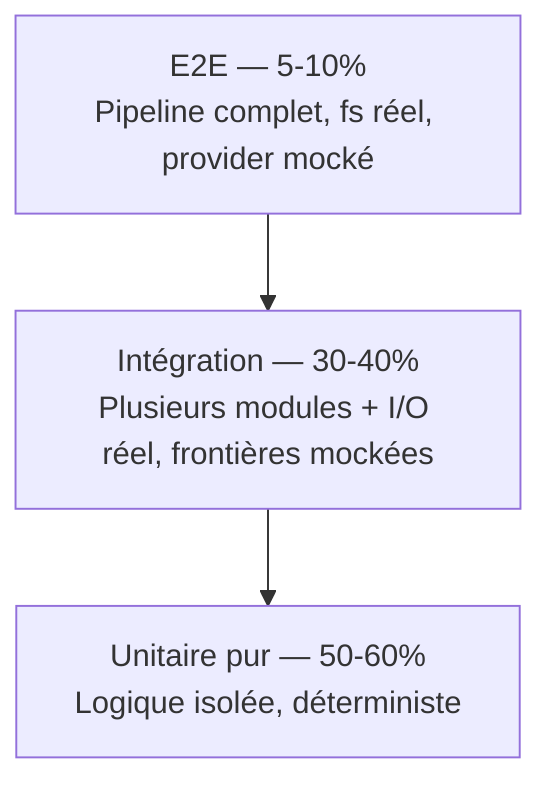

# Étude méthodologique — TDD & tests automatisés

- **Date** : 2026-07-08
- **Demandeur** : Michael Boitin
- **Objet** : définir la méthodologie de développement à appliquer pour la suite du pipeline et au-delà, fondée sur le TDD et une stratégie de tests automatisés claire.

## 1. Contexte et objectif

Le pipeline orchestré (`translator/pipeline.py`) a été développé en Phase 1 **sans TDD** : le code a été écrit d'abord, validé ensuite par dry-run manuel et par la suite de tests existante (qui ne couvre pas le pipeline). Ce désalignement méthodologique doit être corrigé pour les phases 2 et 3 et devenir le standard du projet.

**Objectif** : toute nouvelle fonctionnalité du pipeline (étapes 6-11) et toute évolution future est développée en **TDD strict** (Red → Green → Refactor), avec une stratégie de tests explicite (pyramide unitaire / intégration / e2e) et des conventions cohérentes avec la suite existante.

## 2. État des lieux de la suite de tests actuelle

Mesuré le 2026-07-08 (`pytest --cov`) :

| Module | Stmts | Cover | Remarque |
|---|---:|---:|---|
| `core/cache.py` | 110 | 92% | — |
| `core/config.py` | 145 | 94% | — |
| `core/io_json.py` | 46 | 100% | — |
| `core/io_xlsx.py` | 95 | 93% | — |
| `core/ollama_provider.py` | 242 | 87% | — |
| `core/rate_limiter.py` | 67 | 100% | — |
| `core/translator.py` | 96 | 100% | — |
| `core/translator_factory.py` | 104 | 89% | — |
| `modes/mode_analyze.py` | 76 | 97% | — |
| `modes/mode_translate_dropdowns.py` | 206 | 98% | — |
| `modes/mode_translate_json.py` | 175 | **77%** | point faible |
| `service.py` | 174 | **52%** | point faible (point d'entrée CLI) |
| **TOTAL** | **1536** | **87%** | (le README cite 94% — c'est `core/` seul) |

### Conventions existantes (à préserver)

- **Structure** : une classe `TestXxx` par fonction testée, méthodes `test_yyy`, docstring par test.
- **Séparateurs** : `# ─── Nom ───` entre sections.
- **Fixtures** : centralisées dans `conftest.py` (fs, données, mocks API, reset singletons `autouse`).
- **Mocks** : `unittest.mock.patch` + `MagicMock` (dominant), `pytest-mock` déclaré mais `mocker` non utilisé.
- **Style** : très uniforme (~9/10) sur les 12 fichiers, 771 tests.

### Manques identifiés

1. **Zéro `@pytest.mark.parametrize`** : beaucoup de duplication (~150 méthodes factorisables, ex. `TestDetectInputFormat` 12×, `TestExtractPlaceholders` 17×, `TestDefaultDir*` ×5).
2. **`tmp_path` sous-exploité** : `conftest` recrée `temp_dir` via `tempfile.mkdtemp` au lieu de la fixture built-in `tmp_path` (plus idiomatique et auto-nettoyée).
3. **Code mort** : 3 fixtures `mock_google_translator*` dans `conftest.py` référencées par aucun test, utilisant `pytest.mock.patch` (API non standard).
4. **Aucun test du pipeline** : `pipeline.py` (593 lignes) n'est pas couvert.
5. **E2E limités** : seul `mode_analyze` a un vrai test e2e (`run()` + fichier réel) ; les modes de traduction ne sont testés qu'avec loaders/savers mockés.
6. **`service.py` à 52%** : point d'entrée CLI faiblement couvert.
7. **Aucun `xfail`** : pas de marquage des tests connus instables/non implémentés.

## 3. Méthodologie TDD recommandée

### 3.1 Cycle Red → Green → Refactor (strict)

Pour **chaque** nouvelle fonctionnalité ou changement de comportement :

1. **Red** — Écrire un test qui exprime le comportement attendu, **avant** le code de production. Le test échoue (rouge) car la fonction/le comportement n'existe pas encore ou ne le satisfait pas.
2. **Green** — Écrire le **minimum de code** nécessaire pour faire passer le test. Pas d'optimisation, pas de généralisation prématurée.
3. **Refactor** — Améliorer le code (et les tests) sans changer le comportement. Tous les tests restent verts.

**Règle d'or** : aucun code de production ne peut être écrit sans un test qui le justifie. Les refactors purs (sans nouveau comportement) sont l'exception où on peut modifier du code existant sans nouveau test, à condition que les tests existants couvrent le comportement.

### 3.2 Granularité du test : quoi tester en TDD

TDD s'applique aux **unités testables** (fonctions, méthodes, classes). Pour le pipeline :

| Niveau | Quoi tester en TDD | Exemple pipeline |
|---|---|---|
| **Unitaire pur** | Logique de calcul/ décision isolée, sans I/O | `detect_typos_in_source()` : entrée source + dictionnaire → liste de coquilles. `_list_import_folders()` : tri décroissant. `apply_typo_corrections()` : remplacement dans le dict. |
| **Intégration** | Plusieurs modules + I/O réel (fichiers), frontières externes mockées | `step6_prepopulate_output()` : copie du dernier export + gestion clés modifiées, avec fs réel (`tmp_path`) mais `service.py`/provider mockés. |
| **E2E** | Pipeline complet de bout en bout, fs réel, provider mocké | `run_pipeline(args)` en `--dry-run` sur une source de test : détection → comparaison → coquilles → écart → rapport. |

**Principe** : TDD à l'échelle unitaire (le plus), integration quand il y a de l'I/O, e2e pour les parcours complets. On ne TDD pas l'e2e en premier — on TDD les unités, puis on ajoute l'e2e comme test de confirmation.

### 3.3 Triangulation

Pour les fonctions à logique non triviale, on écrit **au moins 2-3 cas** avant de généraliser :
- Cas nominal
- Cas limite (empty, boundary, single element)
- Cas d'erreur (fichier absent, JSON corrompu, données inattendues)

C'est la « triangulation » TDD : on évite d'écrire un code trop spécifique en testant plusieurs cas.

## 4. Stratégie de test — pyramide adaptée au projet



| Niveau | Part cible | Outils | Vitesse | Déterminisme |
|---|---|---|---|---|
| Unitaire pur | 50-60% | pytest + `tmp_path` (I/O léger) | <1s/test | total |
| Intégration | 30-40% | pytest + `tmp_path` + `@patch` frontières | <2s/test | total (provider mocké) |
| E2E | 5-10% | pytest + fs réel + provider mocké | 2-5s/test | total (aucun réseau) |

**Règle** : aucun test ne fait d'appel réseau réel (Google/DeepL/Ollama). Les providers sont toujours mockés. Les tests e2e du pipeline utilisent une source de test fabriquée, jamais le vrai dossier `output/`.

## 5. Conventions et outils à adopter

### 5.1 À adopter (nouveautés)

| Outil | Usage | Bénéfice |
|---|---|---|
| `@pytest.mark.parametrize` | Factoriser les cas multiples d'une même fonction | -150 méthodes dupliquées, lisibilité accrue |
| `tmp_path` (fixture built-in) | I/O fichier de test auto-nettoyé | remplace `temp_dir` manuel de `conftest` |
| `pytest-cov` (déjà présent) | Mesure de couverture par module | cible 90%+ sur `pipeline.py` |
| markers custom (optionnel) | `@pytest.mark.unit` / `@pytest.mark.integration` / `@pytest.mark.e2e` pour filtrer | sélection rapide (`pytest -m unit`) |

### 5.2 À préserver (existant)

- Classes `TestXxx` + méthodes `test_yyy` + docstring.
- Fixtures centralisées dans `conftest.py`.
- Reset des singletons via fixtures `autouse`.
- `@patch` + `MagicMock` pour les frontières.
- `pytest.raises` pour les cas d'erreur attendus.

### 5.3 À corriger (dette technique)

- Retirer les 3 fixtures `mock_google_translator*` mortes de `conftest.py` (ou les corriger si réutilisées).
- Migrer `temp_dir` vers `tmp_path` progressivement (au fil des refactors).
- Ajouter `--cov` au `pytest.ini` ou au pre-commit pour mesurer la couverture automatiquement.

## 6. Organisation des tests du pipeline

### 6.1 Fichier de test

`translator/tests/test_pipeline.py` — un fichier par module testé, cohérent avec l'existant (`test_<module>.py`).

### 6.2 Structure par étape

Une classe `TestXxx` par étape/fonction publique du pipeline :

```
test_pipeline.py
├── TestListImportFolders        # _list_import_folders()
├── TestPickSourceInImport        # _pick_source_in_import()
├── TestLatestExportDir           # _latest_export_dir()
├── TestStep1DetectSources        # step1_detect_sources() (intégration)
├── TestCompare                   # (déjà dans compare_sources — pas dupliquer)
├── TestStep2CompareSources       # step2_compare_sources()
├── TestLoadTypos                 # load_typos()
├── TestDetectTyposInSource       # detect_typos_in_source()
├── TestApplyTypoCorrections      # apply_typo_corrections()
├── TestStep3DetectTypos          # step3_detect_typos() (intégration + mock input)
├── TestStep4AnalyzeGap           # step4_analyze_gap()
├── TestBuildAnalysisReport       # build_analysis_report()
├── TestStep5ReportAndConfirm     # step5_report_and_confirm() (mock input/confirm)
├── TestConfirm                   # confirm() (mock input, modes dry-run/yes)
├── TestBuildParser               # build_parser() (argparse)
├── TestRunPipeline               # run_pipeline() (e2e dry-run)
└── TestPipelineDryRun            # parcours complet --dry-run sur fs de test
```

### 6.3 Fixtures spécifiques au pipeline (à ajouter dans `conftest.py`)

```python
@pytest.fixture
def fake_source_dir(tmp_path):
    """Dossier source avec 2 imports datés (en9 + en10)."""
    src = tmp_path / "source"
    src.mkdir()
    (src / "2026_06_25_Import").mkdir()
    (src / "2026_07_08_Import").mkdir()
    return src

@pytest.fixture
def fake_export_dir(tmp_path):
    """Dossier export avec 1 export daté et 2 langues."""
    out = tmp_path / "output"
    out.mkdir()
    exp = out / "2026_07_08_Export"
    exp.mkdir()
    (exp / "translation_en_fr.json").write_text('{"K1": "Bonjour"}', encoding="utf-8")
    (exp / "translation_en_de.json").write_text('{"K1": "Hallo"}', encoding="utf-8")
    return out

@pytest.fixture
def fake_typos_file(tmp_path):
    """Dictionnaire de coquilles de test (2 entrées)."""
    import json
    p = tmp_path / "source_typos.json"
    p.write_text(json.dumps({
        "typos": [
            {"typo": "Hiearchy", "correction": "Hierarchy", "first_seen_key": "K1"},
            {"typo": "TItle", "correction": "Title", "first_seen_key": "K2"},
        ]
    }), encoding="utf-8")
    return p
```

## 7. Application concrète aux phases 2 et 3

### 7.1 Phase 2 — étapes 6, 7, 8

Pour chaque étape, le workflow TDD :

**Étape 6 — Pré-peuplement + gestion clés modifiées**
1. Red : `TestStep6Prepopulate` — test que la copie du dernier export crée un nouveau dossier daté avec les bons fichiers.
2. Red : `TestManageModifiedKeys` — pour chaque clé modifiée, l'option 1 supprime la clé, l'option 2 garde, l'option 3 saisie manuelle (mock `input()`).
3. Green : implémenter `step6_prepopulate_output()` + `manage_modified_keys()`.
4. Refactor : factoriser la copie de dossier.

**Étape 7 — Traduction**
1. Red : `TestStep7Translate` — appel à `service.py` via subprocess ou import, avec provider mocké, vérifie que les clés manquantes sont traduites.
2. Green : implémenter `step7_translate()` (wrapper autour de `service.py` ou `modes/mode_translate_json.py`).
3. Refactor.

**Étape 8 — Réordonnancement**
1. Red : `TestReorderToSource` — un fichier JSON désordonné + ordre source → fichier réordonné. `parametrize` sur plusieurs cas (clés manquantes, extras, ordre identique).
2. Green : implémenter `reorder_translation_file()`.
3. Refactor.

### 7.2 Phase 3 — étapes 9, 10, 11

Même pattern. L'étape 9 réutilise `validate()` (déjà testée dans `test_validate_translations.py` à créer), l'étape 10 introduit la heuristique de mésalignement (TDD avec `parametrize` sur cas nominaux + faux positifs), l'étape 11 génère le rapport markdown (snapshot test ou assertions de structure).

## 8. Definition of Done (DoD) par tâche

Une tâche de développement est terminée quand :

- [ ] Les tests TDD (Red → Green → Refactor) sont écrits et passent.
- [ ] `ruff check` + `ruff format --check` sont propres.
- [ ] La suite complète `pytest tests/` passe (771+ tests, régression = 0).
- [ ] La couverture du module concerné est ≥ 90% (vérifiable via `pytest --cov`).
- [ ] Le code est refactorisé (pas de duplication, noms clairs, docstrings).
- [ ] Le tableau de suivi dans `doc/2026_07_08_Pipeline_Orchestre_Analyse.md` est mis à jour.
- [ ] Le commit respecte Conventional Commits (`feat(scope):` / `fix(scope):` / `test(scope):` / `docs:`).

## 9. Intégration CI / pre-commit

- **Pre-commit** (existant) : ruff + pytest-quick via Docker. Conserver.
- **Ajout recommandé** : `pytest --cov=pipeline --cov-fail-under=90` dans le hook pytest-quick pour bloquer les commits qui font chuter la couverture sous le seuil.
- **Marker filtering** (optionnel) : si markers `unit`/`integration`/`e2e` ajoutés, permettre `pytest -m "not e2e"` dans le hook quick pour aller plus vite, et `pytest` complet en CI.

## 10. Recommandations transitoires (Phase 1 rétroactive)

La Phase 1 (`pipeline.py` étapes 1-5) a été développée sans TDD. Pour aligner le projet :

1. **Rattrapage** : écrire `test_pipeline.py` couvrant les étapes 1-5 en mode « characterization tests » (tests qui figent le comportement existant, pas du TDD strict). C'est le compromis pragmatique : on ne refait pas la Phase 1, mais on la couvre rétroactivement avant de démarrer la Phase 2 en TDD.
2. **Cible de couverture Phase 1** : ≥ 90% sur `pipeline.py` après rattrapage.
3. **Puis** Phase 2 en TDD strict dès la première ligne.

## 11. Résumé exécutif

| Aspect | Décision |
|---|---|
| Méthode | TDD strict (Red → Green → Refactor) pour toute nouvelle fonctionnalité |
| Pyramide | 50-60% unitaire / 30-40% intégration / 5-10% e2e |
| Outils | pytest + `parametrize` + `tmp_path` + `pytest-cov` + `@patch`/`MagicMock` |
| Couverture cible | ≥ 90% par module, `pytest --cov` au pre-commit |
| Conventions | Classes `TestXxx`, méthodes `test_yyy`, docstrings, `conftest.py` centralisé |
| Phase 1 | Rattrapage par characterization tests avant Phase 2 |
| Phase 2+ | TDD strict dès la première ligne |
| DoD | tests verts + ruff propre + suite complète OK + cov ≥ 90% + doc de suivi à jour |
| Commit | Conventional Commits, pre-commit hooks (ruff + pytest Docker) |