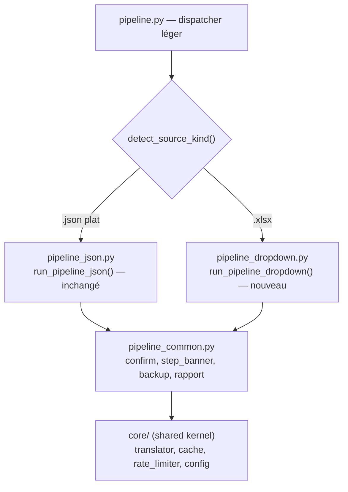

# Étude technique — Intégration du mode dropdown (XLSX) dans le pipeline orchestré

- **Date** : 2026-07-09
- **Auteur** : Michael Boitan
- **Objet** : Étendre `translator/pipeline.py` (11 étapes, `translate-json`) pour couvrir aussi `translate-dropdowns` (XLSX multi-feuilles), afin que les devs soient autonomes sur les deux types de sources.
- **Statut** : Étude mise à jour — décisions tranchées (2026-07-09), prêt pour implémentation TDD.

## 1. Contexte

Le projet dispose aujourd'hui de deux modes de traduction distincts, exposés via `translator/service.py` :

- **`translate-json`** : traduit un fichier JSON plat `{key: text}` (EN → langues cibles). C'est le cas d'usage principal, orchestré par `translator/pipeline.py` (11 étapes : détection → comparaison → coquilles → écart → rapport → pré-peuplement → traduction → réordonnancement → validation → mésalignements → rapport final).
- **`translate-dropdowns`** : traduit un fichier XLSX (ou JSON structuré) de dropdowns vers plusieurs langues (`translator/modes/mode_translate_dropdowns.py`). Sortie soit JSON (un fichier par langue) soit XLSX multi-feuilles.

Les deux modes vivent en parallèle, sans orchestration commune. Le but de cette étude est de **réconcilier le pipeline orchestré avec le mode dropdown** pour qu'un dev lance une seule commande et obtienne le même niveau de garde-fous (comparaison, coquilles, écart, confirmation, validation, rapport) quel que soit le type de source.

## 2. État des lieux — différences JSON vs dropdown

Lecture du code réel (`pipeline.py`, `mode_translate_dropdowns.py`, `mode_translate_json.py`, `io_xlsx.py`, `io_json.py`, `config.py`).

### 2.1 Format de source

| Aspect | `translate-json` (pipeline actuel) | `translate-dropdowns` (mode isolé) |
|---|---|---|
| Fichier source | JSON plat `{key: text}` | XLSX (ou JSON structuré `{metadata, contexts}`) |
| Localisation | `translator/source/{YYYY_MM_DD}_Import/*.json` | `translator/excel/Dropdown_a_traduire.xlsx` (ou `--input`) |
| Lecture source | `json.load()` + `_find_source_file_in_import()` | `load_dropdown_xlsx()` → `wb.active` |
| Clé d'entrée | clé i18n (`LO_AF_CR_1285`) | texte Origin (anglais) + contexte |
| Colonnes | — | A=Origin, B=Traduction(FR), C=Contexte |

### 2.2 Comportement clé du mode dropdown actuel (constats du code)

`translator/core/io_xlsx.py` — `load_dropdown_xlsx()` (L37-84) :

```python
wb = openpyxl.load_workbook(path)
ws = wb.active          # ← ne lit QUE la feuille active
for row in range(2, ws.max_row + 1):
    origin = ...; french = ...; context = ...
    data.append({"origin": ..., "french": ..., "context": ...})
```

**Constat 1** : le mode dropdown ne lit **que la feuille active** du XLSX (`wb.active`). Les feuilles par langue présentes dans le XLSX source (ex. `dropdown_all_languages (1) 1.xlsx` — feuilles EN/FR/CZ/SK/DE/IT/AR, 613 entrées) **ne sont pas lues**.

`mode_translate_dropdowns.py` — `_generate_all_json()` (L301-380) / `_translate_dropdown_entries_batch()` (L216-275) :

```python
for lang in target_langs:
    if lang in ("en", "fr"):
        _generate_json_output(entries, lang, ...)   # extrait depuis la source
    else:
        translations = _translate_dropdown_entries_batch(entries, lang, {})  # traduit tout depuis l'Origin
```

**Constat 2** : pour `cz/sk/de/it/ar/...`, le mode **re-traduit depuis l'Origin (EN)** via l'API, ignorant les traductions déjà présentes dans les feuilles FR/CZ/SK/... du XLSX source. Le resume ne joue que sur les fichiers de sortie JSON déjà écrits (`_load_or_create_output`), pas sur les feuilles du XLSX source.

**Constat 3** : le resume / l'analyse d'écart (`analyze_translation_gap.py`, `compare_sources.py`, `validate_translations.py`) ne fonctionne que sur des **JSON plats** (clé i18n → texte). Rien n'existe pour comparer/valider des feuilles XLSX ou des entrées dropdown (Origin → Traduction).

**Constat 4** : la sortie est soit JSON (un fichier `dropdown_{lang}.json` par langue, structure `{metadata, contexts}`) soit XLSX (`save_dropdown_xlsx` → un fichier `dropdown_all_languages.xlsx` multi-feuilles, une feuille par langue, colonnes Origin/Traduction/Contexte).

**Constat 5** : le dossier de sortie diffère : `{OUTPUT_DIR}/{YYYY_MM_DD}_Dropdown/` (dropdown) vs `{OUTPUT_DIR}/{YYYY_MM_DD}_Export/` (pipeline JSON).

### 2.3 Mécanisme de resume (pour comparaison)

`mode_translate_json._translate_single_language()` (L222-372) :

```python
if output_path.exists():
    translated_data = load_flat_json(output_path)
    existing_keys = set(translated_data.keys())
keys_to_translate = [k for k in keys if k not in existing_keys]   # resume par clé
```

`mode_translate_dropdowns._translate_dropdown_entries_batch()` (L216-275) :

```python
for entry in entries:
    origin = entry["origin"]
    if origin not in existing_translations:   # resume par texte Origin
        texts_to_translate.append(origin)
```

Les deux font du resume par **clé** (JSON) ou par **texte Origin** (dropdown), mais **uniquement sur les fichiers de sortie déjà écrits** — jamais en réutilisant les feuilles existantes du XLSX source.

## 3. Détection du type de source

### 3.1 Options

| Approche | Avantage | Inconvénient |
|---|---|---|
| **Flag explicite** `--mode dropdown` (ou sous-commande) | Sans ambiguïté, simple à coder | Charge cognitive du dev (doit savoir) |
| **Auto-détection par extension** (`.json` → json, `.xlsx` → dropdown) | Zéro friction, « ça marche » | Risque si un JSON structuré de dropdown est passé (`.json` mais mode dropdown) |
| **Hybride** : flag optionnel + auto-détection par défaut | Le meilleur des deux | Légère complexité |

### 3.2 Recommandation

**Hybride** : auto-détection par défaut + flag `--mode {json,dropdown}` pour forcer.

Logique de détection (à implémenter dans une fonction `detect_source_kind(path)` au niveau du pipeline) :

1. Si `--mode` fourni → on l'utilise.
2. Sinon, extension du fichier source :
   - `.xlsx` / `.xls` → `dropdown`
   - `.json` → inspection du contenu : structure `{metadata, contexts}` → `dropdown` (JSON structuré) ; sinon `{key: str}` plat → `json`.
3. Si auto-détection du dossier `*_Import` (pipeline sans `--source`) :
   - Présence d'un `.xlsx` dans le dernier `*_Import` → `dropdown` ;
   - Sinon fallback JSON plat (comportement actuel).

Cela couvre le cas du fichier d'exemple `translator/source/2026_06_29_Import/dropdown_all_languages (1) 1.xlsx` qui vit dans un `*_Import` (même convention de dossiers que le JSON).

## 4. Tableau comparatif des 11 étapes (communes vs spécifiques)

Légende : **C** = commune (réutilisable tel quel ou avec abstraction légère) · **S** = spécifique au mode (branche dédiée) · **P** = partiellement commune (même squelette, données différentes).

| # | Étape | JSON (actuel) | Dropdown (à faire) | Verdict | Notes |
|---|---|---|---|---|---|
| 1 | Détection source + précédente | `_list_import_folders` + `_pick_source_in_import` (JSON) | `_list_import_folders` + recherche `.xlsx` dans `*_Import` | **S** | Le scan de `*_Import` est commun, mais la sélection du fichier diffère (`.json` vs `.xlsx`). |
| 2 | Comparaison des sources | `compare_sources.compare()` sur 2 JSON plats | Comparaison de 2 XLSX (feuilles Origin) ou de 2 listes d'entrées | **S** | `compare_sources.py` travaille sur des dict `{key:value}`. Pour dropdown, la « clé » = texte Origin (+ contexte). Nécessite un adaptateur ou une nouvelle fonction de comparaison par Origin. |
| 3 | Détection coquilles source | `detect_typos_in_source()` parcourt les valeurs d'un dict JSON | Parcourt les `origin` des entrées dropdown | **P** | La logique de matching typo→correction est commune ; seule l'itération sur la source diffère. Factoriser le noyau (`_match_typos(values: list[str])`) et fournir un extracteur par mode. |
| 4 | Analyse écart traduction | `analyze_translation_gap.analyze_export()` sur export JSON | Comparaison des traductions existantes (feuilles XLSX ou JSON structuré) vs nouvelle source | **S** | `analyze_export` attend des `translation_en_{lang}.json`. Pour dropdown, l'écart se calcule par Origin×langue à partir des feuilles existantes du XLSX source (ou d'un export dropdown précédent). Nouvelle fonction. |
| 5 | Rapport consolidé + confirmation | `build_analysis_report()` markdown | Même squelette, sections adaptées | **P** | Le générateur markdown est paramétrable par mode. Garder un `build_analysis_report(ctx)` qui dispatche selon `ctx.mode`. |
| 6 | Pré-peuplement + gestion clés modifiées | Copie `translation_en_{lang}.json` du dernier `*_Export` vers un nouveau dossier daté ; gestion interactive des clés modifiées | Copie des feuilles existantes du XLSX source vers un nouveau XLSX de sortie (ou dossier de JSON) ; gestion des Origins modifiées | **S** | Mécanisme conceptuellement analogue (backup + copie) mais la granularité et le conteneur diffèrent (feuille XLSX / JSON structuré vs fichier JSON plat). |
| 7 | Traduction | `step7_translate` → `_translate_single_language` (JSON) | `_translate_dropdown_entries_batch` par langue, **en réutilisant les feuilles existantes** | **S** | Appelle l'un ou l'autre selon le mode. Voir §5 pour la réutilisation. |
| 8 | Réordonnancement auto | `reorder_translation_file()` selon l'ordre des clés source | Réordonner les entrées selon l'ordre Origin de la source (feuille active) | **P** | Même idée (aligner la sortie sur l'ordre source). L'implémentation diffère (liste d'entrées vs dict ordonné). |
| 9 | Validation structurelle | `validate_translations.validate()` (6 contrôles sur JSON plat) | Validation dropdown : une feuille/fichier par langue, présence de toutes les Origins, pas de Traduction vide, cohérence des contextes | **S** | Le validateur actuel est couplé au format `{key:value}`. Une validation dropdown doit vérifier : toutes Origins présentes dans chaque langue, aucune Traduction vide, contextes cohérents entre langues. Nouveau validateur. |
| 10 | Mésalignements intra-langue | `detect_misalignments()` sur dict source/traduction | Pour dropdown, un même Origin peut apparaître sous plusieurs contextes ; vérifier la cohérence des traductions | **P** | L'heuristique token-overlap se transpose (grouper par texte Origin partagé, comparer les traductions). Adaptateur nécessaire. |
| 11 | Rapport final consolidé | `build_final_report()` 9 sections | Même structure, sections adaptées au format dropdown | **P** | Générateur paramétrable par mode. |

**Synthèse** : 2 étapes vraiment communes après factorisation (3, 10 partielles ; 5, 8, 11 squelettes communs), 5 étapes fortement spécifiques (1, 2, 4, 6, 9), 1 étape qui dispatche (7). Le cœur orchestrateur (l'enchaînement + les confirmations + dry-run + rapport) est **commun**.

## 5. Réutilisation des traductions existantes (point critique)

### 5.1 Le problème

Le XLSX source `dropdown_all_languages (1) 1.xlsx` contient déjà 7 feuilles (EN/FR/CZ/SK/DE/IT/AR) — donc des traductions déjà produites pour FR/CZ/SK/DE/IT/AR. Le mode actuel les **ignore** et re-traduit tout depuis l'Origin (EN), ce qui :

- gaspille des appels API ;
- risque de produire des traductions divergentes des validées manuellement ;
- perd la valeur ajoutée du fichier source.

### 5.2 Solution proposée

**Lire toutes les feuilles du XLSX source, pas seulement la feuille active.**

#### 5.2.1 Nouvelle fonction d'I/O

Dans `translator/core/io_xlsx.py`, ajouter :

```python
def load_dropdown_xlsx_all_sheets(
    file_path: str | Path,
    languages: dict[str, dict] | None = None,
) -> tuple[list[dict[str, str]], dict[str, dict[str, str]]]:
    """
    Charge un XLSX dropdown en lisant TOUTES les feuilles par langue.

    Returns:
        entries: liste des entrées de référence {origin, french, context}
                 (depuis la feuille source active ou la feuille EN).
        existing_translations: {lang_code: {origin: traduction}} pour chaque
                               feuille de langue présente.
    """
```

Logique :
1. Ouvrir le classeur, lister `wb.sheetnames`.
2. Identifier la feuille de référence (active, ou `EN`/`en` si présente) → construit `entries` (colonnes Origin/Traduction/Contexte).
3. Pour chaque autre feuille dont le nom (insensible casse) correspond à un code de `LANGUAGES` (ex. `FR`, `CZ`, `SK`...), lire les colonnes Origin/Traduction et remplir `existing_translations[lang_code][origin] = traduction`.
4. Retourner les deux structures.

#### 5.2.2 Détection des langues manquantes

```python
def detect_missing_languages(
    existing_sheets: set[str],   # noms de feuilles présentes (ex. {"EN","FR","CZ"})
    configured_langs: list[str],  # ex. ["en","fr","cz","sk","de","it","ar",...]
) -> list[str]:
    """Langues configurées sans feuille correspondante dans le XLSX source."""
    present = {name.lower() for name in existing_sheets}
    return [lang for lang in configured_langs if lang not in present]
```

→ Le pipeline ne traduit que les langues manquantes (ex. si `PT/ES/HU` configurés mais absents du XLSX, ne traduire que celles-ci ; les feuilles FR/CZ/SK/DE/IT/AR sont réutilisées telles quelles).

#### 5.2.3 Intégration à l'étape 7 (traduction dropdown)

Adapter `_translate_dropdown_entries_batch` pour accepter les traductions existantes issues des feuilles (et non seulement d'un fichier de sortie précédent) :

```python
translations = _translate_dropdown_entries_batch(
    entries,
    target_lang=lang,
    existing_translations=existing_translations.get(lang, {}),  # ← feuille source
)
```

Le mécanisme de resume existant (`if origin not in existing_translations`) fait alors le reste : seuls les Origins non déjà traduits sont envoyés à l'API.

#### 5.2.4 Cas de la feuille FR

La feuille FR du XLSX source fournit `french` pour la colonne B. Actuellement `load_dropdown_xlsx` lit la colonne B de la feuille active comme `french`. Avec la nouvelle lecture multi-feuilles, on peut soit :
- **(a)** garder la colonne B de la feuille active comme `french` (comportement actuel) et lire la feuille FR séparément pour valider la cohérence ;
- **(b)** utiliser la feuille FR dédiée comme source de `french` (plus propre si la feuille active est EN).

→ Décision à trancher (§12). Recommandation : **(b)** quand une feuille FR explicite existe, fallback **(a)** sinon.

## 6. Format de sortie

### 6.1 Options

| Option | Description | Avantage | Inconvénient |
|---|---|---|---|
| **A. XLSX multi-feuilles unique** | `dropdown_all_languages.xlsx` (une feuille par langue, Origin/Traduction/Contexte) | Format natif du métier, un seul fichier à livrer | Fusion manuelle si on veut JSON pour l'app |
| **B. JSON par langue** | `dropdown_{lang}.json` (structure `{metadata, contexts}`) | Format directement consommable par l'app | Plusieurs fichiers, pas de vue consolidée |
| **C. Les deux** | Produire le XLSX consolidé + les JSON | Couvre tous les usages | Double écriture |

### 6.2 Recommandation

**Option C pilotée par `--format`** (déjà présent dans `service.py` pour le mode dropdown : `json|xlsx|auto`). Le pipeline reprend ce flag. `auto` ⇒ format d'entrée (`xlsx` → `xlsx`, `json` structuré → `json`).

### 6.3 Fusion nouvelles langues + traductions existantes

Pour produire le XLSX de sortie consolidé :

1. Charger les `entries` (feuille de référence) et `existing_translations` (toutes les feuilles source).
2. Traduire uniquement les langues manquantes (§5.2.2).
3. Fusionner : `final_translations[lang][origin] = existing_translations.get(lang, {}).get(origin) or translated[origin]`.
4. Appeler `save_dropdown_xlsx(entries, final_translations, output_path, langs)` — fonction existante qui crée une feuille par langue.

Pour le JSON : `_generate_all_json` existant, en lui passant `existing_translations` par langue (modification mineure de la signature).

Dossier de sortie : conserver la convention `{OUTPUT_DIR}/{YYYY_MM_DD}_Dropdown/` du mode dropdown (distinct de `*_Export` du JSON) pour éviter tout mélange.

## 7. Détection des langues manquantes

Voir §5.2.2 (`detect_missing_languages`). À intégrer à l'**étape 1** (ou 4) du pipeline dropdown :

```
Langues configurées : en, fr, cz, sk, de, it, ar, pt, es, hu
Feuilles présentes  : EN, FR, CZ, SK, DE, IT, AR
Langues manquantes  : pt, es, hu   → seules celles-ci seront traduites
```

Affiché dans le rapport d'analyse (étape 5) et le rapport final (étape 11).

## 8. Architecture proposée

### 8.1 Trois options envisagées

1. **Pipeline unique avec branches conditionnelles** (`if ctx.mode == "dropdown"` dans chaque étape).
   - *Pour* : un seul fichier, zéro duplication d'orchestration.
   - *Contre* : chaque étape devient un switch, difficile à lire et tester ; violation d'Open/Closed.

2. **Deux pipelines séparés** (`pipeline_json.py` + `pipeline_dropdown.py`) + un dispatcher `pipeline.py`.
   - *Pour* : chaque pipeline reste lisible et spécialisé.
   - *Contre* : duplication de l'orchestration (boucle d'étapes, dry-run, confirmations, rapport).

3. **Pipeline générique + stratégies par mode** (pattern Strategy).
   - *Pour* : orchestration commune (la valeur réelle) + logique par mode isolée et testable ; évite la duplication ; nouveau mode = nouvelle stratégie sans toucher l'orchestrateur.
   - *Contre* : refactoring initial pour extraire l'orchestration commune.

### 8.2 Décision : option 2 (2 pipelines séparés, DDD)

**Décision tranchée (2026-07-09)** : architecture DDD avec **2 pipelines séparés**.

Justification (approche Domain-Driven) :
- Le JSON i18n et le dropdown sont deux **bounded contexts** distincts : clé i18n stable vs Origin+contexte, JSON plat vs XLSX multi-feuilles, comparaison par clé vs comparaison par Origin, validation structurelle vs cohérence de feuilles.
- Chaque pipeline garde sa logique propre, **lisible et spécialisée**, sans branches conditionnelles.
- `pipeline.py` (JSON) reste **intact** → zéro régression sur les 917 tests existants.
- Le partage (provider, cache, rate limiter, helpers d'orchestration) se fait via un **shared kernel** : `pipeline_common.py` (helpers : `confirm`, `step_banner`, sauvegarde, rapport) + `core/` existant.

### 8.3 Structure proposée



- `pipeline.py` devient un **dispatcher léger** : détecte le type de source (extension/contenu), délègue à `pipeline_json.py` ou `pipeline_dropdown.py`.
- `pipeline_json.py` reprend l'orchestration JSON existante (étapes 1-11) sans changement de comportement.
- `pipeline_dropdown.py` implémente l'orchestration dropdown (étapes 1-11 adaptées).
- `pipeline_common.py` factorise les helpers partagés : `confirm()`, `step_banner()`, `backup_translation_file()`, `build_analysis_report_common()`, etc.

#### Migration incrémentale (sans casser l'existant)

1. **Étape A** : extraire les helpers partagés de `pipeline.py` vers `pipeline_common.py` ; `pipeline.py` les réimporte (comportement JSON strictement identique).
2. **Étape B** : créer `pipeline_dropdown.py` avec les étapes 1-11 adaptées au format XLSX.
3. **Étape C** : `pipeline.py` expose un `--mode` optionnel + auto-détection (extension) → dispatcher.

Ainsi, le chemin JSON garde ses 917 tests verts sans toucher à la logique des étapes.

### 8.4 Arborescence cible

```
translator/
├── pipeline.py                      # dispatcher léger (detect_source_kind + delegation)
├── pipeline_common.py               # shared kernel : confirm, step_banner, backup, rapport
├── pipeline_json.py                 # orchestration JSON (étapes 1-11, ex-pipeline.py)
├── pipeline_dropdown.py             # orchestration dropdown (nouveau)
├── core/
│   ├── io_xlsx.py                   # + load_dropdown_xlsx_all_sheets, detect_missing_languages
│   └── ...                          # translator, cache, rate_limiter, config (shared kernel)
└── modes/                           # inchangé (utilisé par les pipelines)
```

## 9. Impact sur le code existant

### 9.1 Fichiers modifiés

| Fichier | Modification | Risque |
|---|---|---|
| `translator/pipeline.py` | Devient un **dispatcher léger** : `detect_source_kind()` (extension/contenu) + `--mode` optionnel → délègue à `pipeline_json.py` ou `pipeline_dropdown.py`. L'orchestration JSON existante migre vers `pipeline_json.py`. | Faible si migration incrémentale (extraction des helpers vers `pipeline_common.py`, comportement JSON identique). |
| `translator/pipeline_common.py` | **Nouveau** : helpers partagés (`confirm`, `step_banner`, `backup_translation_file`, `PipelineContext` de base, `short_repr`, `json_load`/`json_write`). | Nul (nouveau fichier). |
| `translator/pipeline_json.py` | **Nouveau** : reprend l'orchestration JSON (étapes 1-11, ex-`pipeline.py`) en réimportant les helpers de `pipeline_common.py`. | Faible (comportement identique, tests existants rejoués). |
| `translator/pipeline_dropdown.py` | **Nouveau** : orchestration dropdown (étapes 1-11 adaptées). | Nul (nouveau fichier). |
| `translator/core/io_xlsx.py` | Ajouter `load_dropdown_xlsx_all_sheets()` + `detect_missing_languages()`. | Nul (ajout pur, `load_dropdown_xlsx` inchangé). |
| `translator/modes/mode_translate_dropdowns.py` | Permettre d'injecter `existing_translations` dans `_translate_dropdown_entries_batch` (déjà le cas via le paramètre — juste appeler avec les feuilles source). | Faible. |
| `compare_sources.py` / `analyze_translation_gap.py` / `validate_translations.py` | **Aucune modification** pour JSON. Pour dropdown : adaptateurs dans `pipeline_dropdown.py` (pas de modification des scripts originaux). | Nul pour JSON. |

### 9.2 Fonctions du pipeline à généraliser

| Fonction | Action |
|---|---|
| `step1_detect_sources` | Scinder en `detect_import_folders()` (commun) + `pick_source_file()` (par mode). |
| `step2_compare_sources` | Garder pour JSON ; nouveau `compare_dropdown_sources()` dans la stratégie dropdown. |
| `step3_detect_typos` | Extraire le noyau `_match_typos(values)` commun ; les extracteurs de valeurs diffèrent par mode. |
| `step5_report_and_confirm` / `build_analysis_report` | Paramétrer par mode (sections conditionnelles). |
| `step6_prepopulate_and_manage` | Spécifique par mode (mécanisme de copie différent). |
| `step7_translate` | Dispatcher vers `_translate_single_language` (JSON) ou `_translate_dropdown_entries_batch` (dropdown). |
| `step8_reorder` | Spécifique (dict ordonné vs liste d'entrées). |
| `step9_validate` | Spécifique (`validate_translations.validate()` pour JSON ; nouveau validateur dropdown). |
| `step10_detect_misalignments` | Adapter l'extracteur (grouper par Origin partagé au lieu de par texte source). |
| `step11_final_report` / `build_final_report` | Paramétrer par mode. |

## 10. Nouvelles fonctions à créer

### 10.1 `translator/core/io_xlsx.py`

- `load_dropdown_xlsx_all_sheets(file_path, languages=None) -> tuple[list[dict], dict[str, dict[str, str]]]` — lire toutes les feuilles par langue (§5.2.1).
- `detect_missing_languages(existing_sheet_names, configured_langs) -> list[str]` (§5.2.2). *Peut vivre dans `io_xlsx.py` ou `dropdown_strategy.py`.*
- `compare_dropdown_sources(old_xlsx, new_xlsx) -> DropdownComparison` — ajouté/supprimé/modifié par Origin (analogue à `compare_sources.compare`).
- `validate_dropdown(entries, translations_by_lang, langs) -> DropdownValidationReport` — vérifie : toutes Origins présentes par langue, aucune Traduction vide, contextes cohérents.

### 10.2 `translator/strategies/dropdown_strategy.py`

- `DropdownStrategy` implémentant les 11 méthodes du protocol.
- `_extract_dropdown_typos_values(entries) -> list[str]` — extrait les Origins pour la détection de coquilles (étape 3).
- `_analyze_dropdown_gap(new_entries, prev_entries, existing_translations, langs) -> list` — écart par langue (Origins à ajouter/supprimer/modifier).
- `_prepopulate_dropdown_output(source_xlsx, existing_translations, langs, output_dir) -> Path` — crée le dossier `{date}_Dropdown` et copie les feuilles existantes.
- `_manage_modified_origins(modified, translations_by_lang, interactive)` — analogue à `manage_modified_keys` pour les Origins modifiées.

### 10.3 `translator/strategies/base.py`

- `PipelineStrategy` (Protocol), `PipelineContext` (déplacé/étendu avec `mode`, `existing_translations`, `entries`).

### 10.4 `translator/pipeline.py`

- `detect_source_kind(path) -> str` — auto-détection (§3).
- `select_strategy(args) -> PipelineStrategy` — instancie la bonne stratégie.

## 11. Tests (TDD)

### 11.1 Approche

Conformément à la pratique du projet (TDD strict Red→Green→Refactor, cf. `doc/2026_07_08_Pipeline_Orchestre_Analyse.md`), chaque nouvelle fonction est testée avant implémentation. Cible de couverture : ≥ 90 % sur les nouveaux modules.

### 11.2 Fixtures

- **Fixture XLSX synthétique** (construit via `openpyxl` dans `tmp_path`) : un classeur de test avec feuilles EN/FR/CZ + une langue manquante (ex. `DE`). Permet de tester sans API et sans le fichier métier de 613 entrées.
- **Fixture XLSX métier** : `translator/source/2026_06_29_Import/dropdown_all_languages (1) 1.xlsx` (smoke test, pas en CI si trop lourd).
- **Fixtures JSON structurés** : un `dropdown_en.json` de référence + un partiel pour tester le resume.
- **Mocks** : `translate_batch` mocké (comme pour le pipeline JSON actuel) pour valider l'enchaînement sans appels API.

### 11.3 Tests unitaires prioritaires

| Module/fonction | Tests |
|---|---|
| `load_dropdown_xlsx_all_sheets` | lit toutes les feuilles ; mappe les noms de feuilles aux codes langue ; feuille manquante ignorée ; colonne B de la feuille active vs feuille FR dédiée. |
| `detect_missing_languages` | langues configurées vs feuilles présentes ; casse insensible ; `en` exclu des cibles. |
| `compare_dropdown_sources` | Origins ajoutées/supprimées/modifiées ; contextes divergents. |
| `validate_dropdown` | Origins manquantes par langue ; Traduction vide ; contextes incohérents ; tout OK. |
| `DropdownStrategy.detect_sources` | détection du `.xlsx` dans `*_Import` ; fallback JSON ; `--mode` forcé. |
| `DropdownStrategy.translate` | ne traduit que les langues manquantes ; réutilise les feuilles existantes ; resume via fichier de sortie. |
| `detect_source_kind` | `.json` plat vs `.json` structuré vs `.xlsx` ; `--mode` override. |
| `select_strategy` | retourne `JsonStrategy` / `DropdownStrategy` selon `--mode` + auto-détection. |
| Orchestrateur `run_pipeline` (dropdown) | dry-run complet (aucun fichier créé) ; confirmation refusée stoppe ; `--yes` passe toutes les confirmations ; rapport final écrit dans `doc/`. |
| Non-régression JSON | `run_pipeline` avec source JSON → comportement identique (sous-ensemble des 917 tests existants). |

### 11.4 Tests d'intégration

- **e2e dropdown dry-run** sur le XLSX métier : rapport d'analyse produit, aucune écriture.
- **e2e dropdown `--yes`** avec API mockée : XLSX de sortie consolidé avec feuilles FR/CZ/SK/DE/IT/AR réutilisées + nouvelles langues traduites.

## 12. Découpage en tâches + estimation

Architecture retenue : 2 pipelines séparés (DDD) + `pipeline_common.py` (shared kernel).

| # | Tâche | Statut | Estimation | Dépendance |
|---|---|:---:|---|---|
| D1 | Refactoring : extraire `pipeline_common.py` (helpers partagés : `confirm`, `step_banner`, `backup_translation_file`, `PipelineContext` de base) ; `pipeline.py` les réimporte (comportement JSON strictement identique) | ✅ | ~2h | — |
| D2 | `pipeline.py` → dispatcher léger : `detect_source_kind()` (extension/contenu) + `--mode` optionnel ; délégation à `pipeline_json.py` (ex-`run_pipeline`) ou `pipeline_dropdown.py` | ✅ | ~1h | D1 |
| D3 | `io_xlsx.load_dropdown_xlsx_all_sheets` + `detect_missing_languages` (TDD) | ✅ | ~1.5h | — |
| D4 | `pipeline_dropdown.py` : `PipelineDropdownContext` + `build_parser_dropdown()` + flags `--retranslate-all` / `--retranslate` / `--no-cache` (TDD) | ✅ | ~1h | D1, D2 |
| D5 | `pipeline_dropdown.py` étapes 1-2 (détection XLSX + comparaison par Origin, skip si pas de précédent) (TDD) | ✅ | ~2h | D3, D4 |
| D6 | `pipeline_dropdown.py` étape 3 (coquilles sur Origins — `source_typos.json` avec `scope`) (TDD) | ✅ | ~1h | D5 |
| D7 | `pipeline_dropdown.py` étape 4 (écart dropdown par langue — langues manquantes) (TDD) | ✅ | ~1.5h | D5 |
| D8 | `pipeline_dropdown.py` étape 5 (rapport + confirmation) (TDD) | ✅ | ~1h | D6, D7 |
| D9 | `pipeline_dropdown.py` étape 6 (pré-peuplement XLSX + gestion Origins modifiées) (TDD) | ⬜ | ~2h | D8 |
| D10 | `pipeline_dropdown.py` étape 7 (traduction avec réutilisation colonne B des feuilles existantes) (TDD) | ⬜ | ~1.5h | D3, D9 |
| D11 | `pipeline_dropdown.py` étape 8 (réordonnancement par Origin) (TDD) | ⬜ | ~45min | D10 |
| D12 | `validate_dropdown` + étape 9 (TDD) | ⬜ | ~1.5h | D10 |
| D13 | `pipeline_dropdown.py` étape 10 (mésalignements par Origin partagé dans un même contexte) (TDD) | ⬜ | ~1h | D10 |
| D14 | `pipeline_dropdown.py` étape 11 (rapport final adapté) (TDD) | ⬜ | ~1h | D12, D13 |
| D15 | Tests d'intégration e2e (dry-run + `--yes` mocké sur le XLSX en10) | ⬜ | ~1.5h | D14 |
| D16 | Documentation (README FR/EN + section pipeline dropdown) + `--no-cache` ajouté au pipeline JSON | ⬜ | ~1h | D14 |
| D17 | Non-régression : suite complète (917 tests + nouveaux) | ⬜ | ~30min | D14 |
| **Total** | | | **~21h** (~3 jours dev) | |

### Notes de progression

- **2026-07-09 — Phase D1 terminée (D1-D3)** : extraction du shared kernel `pipeline_common.py` (helpers : `confirm`, `step_banner`, `backup_translation_file`, `BasePipelineContext`, `short_repr`, `json_load`/`json_write`) ; `pipeline.py` les réimporte sans changement de comportement (917 tests verts). D2 : `detect_source_kind()` (auto par extension) + flag `--mode` + dispatcher dans `run_pipeline` (13 tests TDD). D3 : `load_dropdown_xlsx_all_sheets()` + `detect_missing_languages()` dans `core/io_xlsx.py` (8 tests TDD). Suite complète : 938 tests OK, ruff propre.
- **Tâches D4-D17** : à implémenter (Phases D2-D5).

Découpage de phase possible, calqué sur le JSON :

- **Phase D1** (orchestration + stratégies) : D1-D4 — ~5h.
- **Phase D2** (analyse : étapes 1-5) : D5-D8 — ~5.5h.
- **Phase D3** (exécution : étapes 6-8) : D9-D11 — ~4h.
- **Phase D4** (validation + rapport : étapes 9-11) : D12-D14 — ~3.5h.
- **Phase D5** (intégration + doc) : D15-D17 — ~3h.

## 13. Décisions tranchées (2026-07-09)

1. **Détection du type de source** : **hybride** — auto-détection par extension/contenu (`.xlsx` → dropdown, `.json` plat → JSON) + flag `--mode` optionnel pour forcer.
2. **Source de la colonne `french`** : **réutiliser les feuilles par langue existantes** comme cache. Nouvelle fonction `load_dropdown_xlsx_all_sheets()` lit toutes les feuilles ; la colonne B de chaque feuille = cache de traduction déjà validé. On ne re-traduit que les langues manquantes.
3. **Format de sortie par défaut** : `auto` (≡ format d'entrée) ; `--format json|xlsx` pour forcer. Dossier `{YYYY_MM_DD}_Dropdown/` distinct de `*_Export/`.
4. **Comparaison de sources dropdown (étape 2)** : **implémentée mais skippée** si pas de XLSX précédent (comme le JSON quand il n'y a qu'un seul `*_Import`). Prête pour le futur — s'activera dès qu'il y aura deux versions de XLSX dropdown.
5. **Coquilles source (étape 3)** : dictionnaire `source_typos.json` existant étendu avec un champ `scope: json|dropdown|both` (défaut `both`). Les coquilles dropdown ciblent les Origins (texte EN).
6. **Validation dropdown (étape 9)** : **bloquant** si Origins manquantes ou Traduction vide ; **avertissement** si contextes incohérents entre langues ou traductions identiques à l'Origin (noms propres légitimes → avertissement, pas échec).
7. **Architecture** : **2 pipelines séparés (DDD)** — `pipeline_json.py` + `pipeline_dropdown.py` + `pipeline_common.py` (shared kernel) + dispatcher léger dans `pipeline.py`. Décision motivée par la séparation des bounded contexts (clé i18n vs Origin+contexte).
8. **Dossier de sortie** : `{YYYY_MM_DD}_Dropdown/` **distinct** de `{YYYY_MM_DD}_Export/` (recommandé).
9. **Réutilisation des feuilles existantes** : **réutilisation stricte** par défaut (jamais de retraduction des langues déjà présentes). Flags de retraduction optionnels (voir §14).
10. **Mésalignements dropdown (étape 10)** : heuristique **restreinte au sein d'un même contexte** (un même Origin peut avoir des traductions légitimement différentes selon le contexte → on ne compare que les Origins partagés dans le même contexte).

## 14. Options de retraduction et cache

Deux caches distincts et orthogonaux :

| Cache | Rôle | Contrôle |
|---|---|---|
| **Cache colonne B** (feuilles du XLSX source) | Réutilise les traductions déjà présentes dans les feuilles FR/CZ/SK/... | `--retranslate-all` / `--retranslate` (flags pipeline) |
| **Cache du service** (`.translation_cache.json`) | Évite de re-traduire un texte déjà traduit via l'API (lookup par `src:tgt:key_id:text`) | `--no-cache` (flag pipeline, propage `TRANSLATION_CACHE=false`) |

### Flags CLI du pipeline dropdown

| Flag | Comportement |
|---|---|
| *(défaut)* | Col B réutilisée pour les langues existantes + cache service activé. Ne traduit que les nouveautés (Origins ajoutés) + les langues manquantes. |
| `--retranslate-all` | Ignore le cache colonne B → re-traduit toutes les langues depuis l'Origin. |
| `--retranslate fr,de` | Retraduit les langues listées, garde le cache colonne B pour les autres. |
| `--no-cache` | Désactive le cache du service → chaque appel API fait une vraie traduction (pas de lookup `.translation_cache.json`). |

Combinaisons possibles : `--retranslate-all --no-cache` = tout retraduire à frais, sans aucun cache.

> **Note** : `--no-cache` sera aussi ajouté au pipeline JSON existant (cohérence, faible effort — propager `TRANSLATION_CACHE=false` dans le `Config`).

---

## Annexe A — Points clés confirmés dans le code

| Point clé | Confirmation (fichier:ligne) |
|---|---|
| Le mode dropdown ne lit que la feuille active | `io_xlsx.py:66` — `ws = wb.active` |
| Re-traduit depuis l'Origin, ignore les feuilles par langue | `mode_translate_dropdowns.py:324-363` — `if lang in ("en","fr")` extrait, sinon `_translate_dropdown_entries_batch(entries, lang, {})` |
| Resume = fichier de sortie déjà écrit, pas feuilles source | `mode_translate_dropdowns.py:150-165` — `_load_or_create_output` lit `output_path` |
| Sortie JSON = `dropdown_{lang}.json` (structure `{metadata, contexts}`) | `mode_translate_dropdowns.py:322` |
| Sortie XLSX = `dropdown_all_languages.xlsx` multi-feuilles | `mode_translate_dropdowns.py:400` + `io_xlsx.save_dropdown_xlsx` |
| Dossier sortie dropdown = `{OUTPUT_DIR}/{YYYY_MM_DD}_Dropdown/` | `mode_translate_dropdowns.py:447-449` |
| Pipeline JSON : dossier `*_Import` (source) + `*_Export` (sortie) | `pipeline.py:128-151` |
| `analyze_export` / `compare` / `validate` couplés au JSON plat | `analyze_translation_gap.py`, `compare_sources.py`, `validate_translations.py` |
| `LANGUAGES` : `source_col` = `origin` pour toutes langues sauf `fr` (`french`) | `config.py:17-28` |
| XLSX source d'exemple : 7 feuilles EN/FR/CZ/SK/DE/IT/AR, 613 entrées, 3 colonnes | Fourni par le user ; `load_dropdown_xlsx` confirme la lecture 3 colonnes A/B/C |

## Annexe B — Risques et mitigations

| Risque | Mitigation |
|---|---|
| Régression sur le pipeline JSON (917 tests) | Migration incrémentale : `JsonStrategy` délègue aux fonctions existantes sans réécrire. Suite complète rejouée à chaque phase. |
| Faux positifs mésalignements dropdown (Origins partagés entre contextes) | Restreindre la comparaison au sein d'un même contexte (décision §13-10). |
| Perte des traductions manuelles validées | Réutilisation stricte des feuilles existantes (§5) ; aucune traduction existante écrasée sans `--retranslate-existing`. |
| XLSX métier lourd en CI | Fixtures synthétiques `openpyxl` dans `tmp_path` ; XLSX métier en smoke test optionnel. |
| `openpyxl` non installé dans l'environnement courant | Vérifier `requirements.txt` / environnement de dev avant de lancer les tests (constat : `openpyxl` absent de l'env shell courant — confirmer qu'il est bien dans l'env d'exécution du projet). |